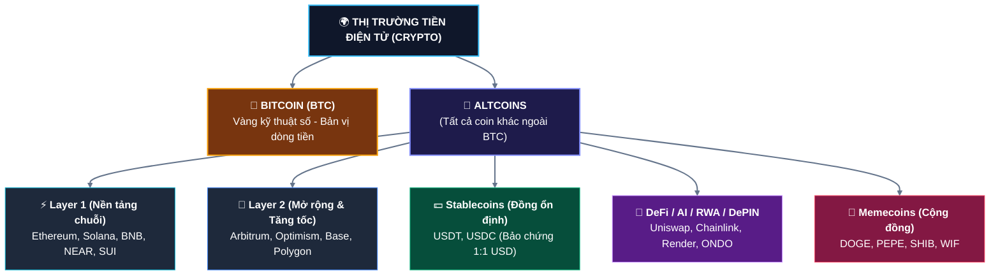
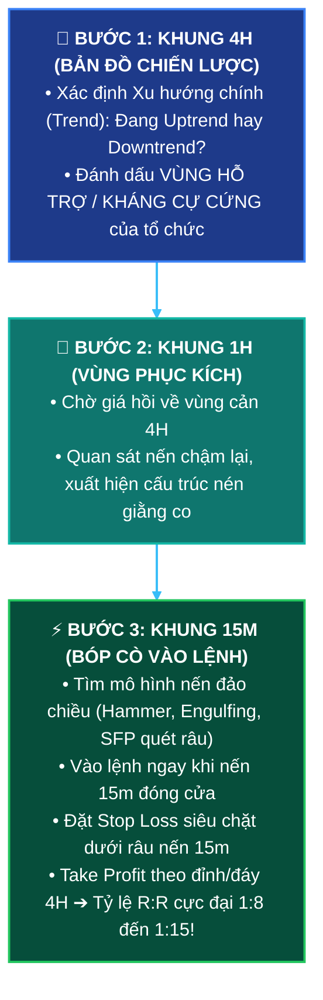
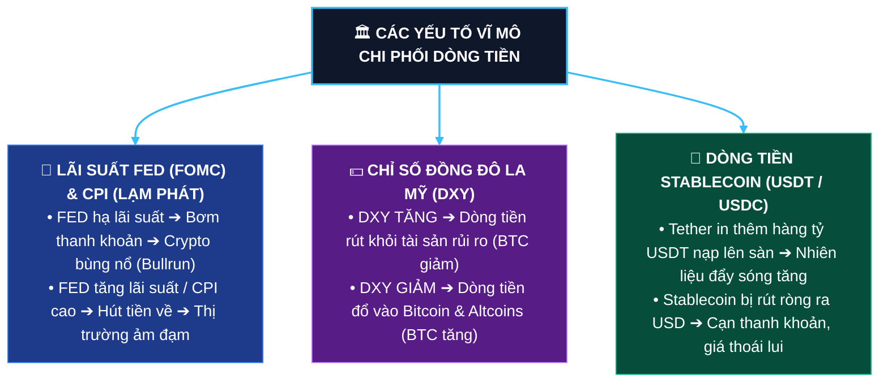
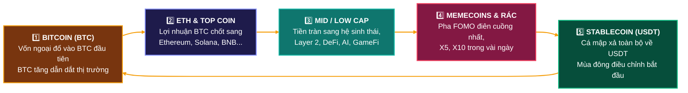
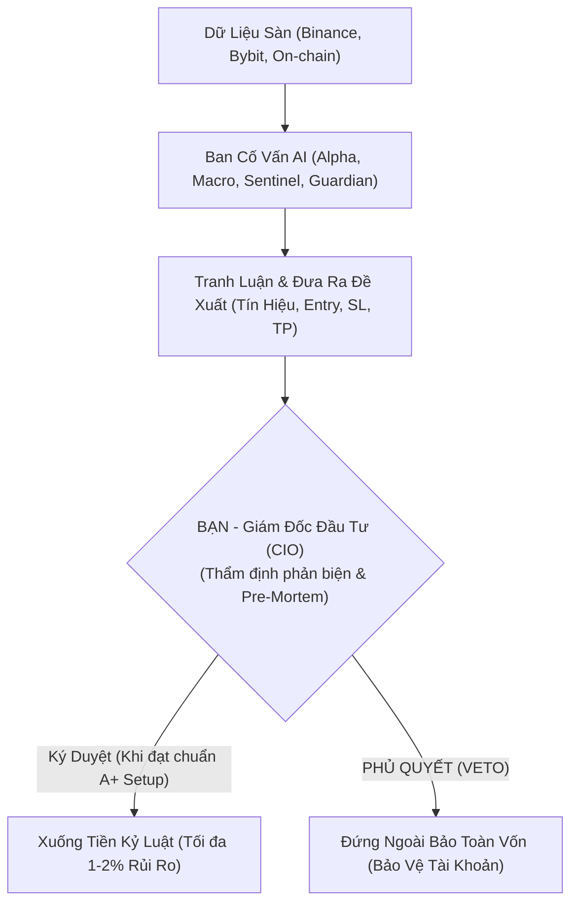
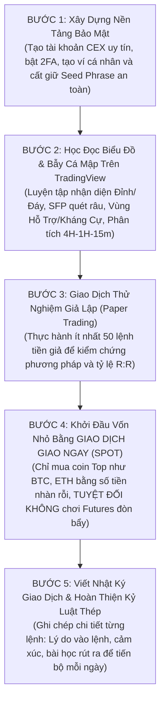

# 📘 GIÁO TRÌNH NHẬP MÔN TIỀN ĐIỆN TỬ (CRYPTO) & PHÂN TÍCH KỸ THUẬT THỰC CHIẾN TỪ A - Z
> **Dành riêng cho người mới bắt đầu đến nâng cao (Beginner to Pro Trader)**  
> *Tài liệu biên soạn chi tiết 100% thực tiễn, trực quan với mô hình nến, phân tích đa khung thời gian 4H - 1H - 15m, cơ chế tác động thị trường, chu kỳ dòng tiền và 7 dấu hiệu nhận biết Cá mập (Market Maker) thao túng & quét sàn.*

---

## 📑 MỤC LỤC
1. [Chương 1: Bản Chất Tiền Điện Tử & Công Nghệ Blockchain](#chương-1-bản-chất-tiền-điện-tử--công-nghệ-blockchain)
2. [Chương 2: Phân Loại Coin, Ví Lưu Trữ & Sàn Giao Dịch (Spot vs Futures)](#chương-2-phân-loại-coin-ví-lưu-trữ--sàn-giao-dịch-spot-vs-futures)
3. [Chương 3: Bản Chất Thị Trường, Cơ Chế Khớp Lệnh (Order Book) & Bể Thanh Khoản (Liquidity Pools)](#chương-3-bản-chất-thị-trường-cơ-chế-khớp-lệnh-order-book--bể-thanh-khoản-liquidity-pools)
4. [Chương 4: Các Mô Hình Nến Đảo Chiều Quan Trọng (Kèm Minh Họa Trực Quan)](#chương-4-các-mô-hình-nến-đảo-chiều-quan-trọng-kèm-minh-họa-trực-quan)
5. [Chương 5: Vùng Hỗ Trợ & Kháng Cự Chuyên Sâu, Bẫy Thị Trường & Cơ Chế Quét Thanh Khoản](#chương-5-vùng-hỗ-trợ--kháng-cự-chuyên-sâu-bẫy-thị-trường--cơ-chế-quét-thanh-khoản)
6. [Chương 6: Cấu Trúc Thị Trường, Xu Hướng & Bẫy Cấu Trúc (Market Structure & Traps)](#chương-6-cấu-trúc-thị-trường-xu-hướng--bẫy-cấu-trúc-market-structure--traps)
7. [Chương 7: Chuyên Đề Đa Khung Thời Gian (4H - 1H - 15M), Cách Xác Định Đỉnh Đáy & Khung Giờ Vàng (Killzones)](#chương-7-chuyên-đề-đa-khung-thời-gian-4h---1h---15m-cách-xác-định-đỉnh-đáy--khung-giờ-vàng-killzones)
8. [Chương 8: Khối Lượng (Volume), Các Chỉ Báo Kỹ Thuật & Dữ Liệu Phái Sinh (OI & Funding)](#chương-8-khối-lượng-volume-các-chỉ-báo-kỹ-thuật--dữ-liệu-phái-sinh-oi--funding)
9. [Chương 9: CHUYÊN ĐỀ ĐẶC BIỆT: TÁC ĐỘNG THỊ TRƯỜNG, CHU KỲ DÒNG TIỀN & 7 DẤU HIỆU CÁ MẬP QUÉT SÀN](#chương-9-chuyên-đề-đặc-biệt-tác-động-thị-trường-chu-kỳ-dòng-tiền--7-dấu-hiệu-cá-mập-quét-sàn)
10. [Chương 10: Quản Lý Vốn & Tâm Lý Giao Dịch (Nguyên Tắc Sống Còn)](#chương-10-quản-lý-vốn--tâm-lý-giao-dịch-nguyên-tắc-sống-còn)
11. [Chương 11: Từ Điển Thuật Ngữ Crypto & Smart Money Concepts (SMC) Đầy Đủ Nhất](#chương-11-từ-điển-thuật-ngữ-crypto--smart-money-concepts-smc-đầy-đủ-nhất)
12. [Chương 12: Lộ Trình Thực Hành An Toàn Cho Người Mới & Bộ Cẩm Nang Thẩm Định AI (CIO Playbook)](#chương-12-lộ-trình-thực-hành-an-toàn-cho-người-mới--bộ-cẩm-nang-thẩm-định-ai-cio-playbook)

---

# CHƯƠNG 1: BẢN CHẤT TIỀN ĐIỆN TỬ & CÔNG NGHỆ BLOCKCHAIN

## 1.1. Tiền điện tử (Cryptocurrency) là gì?
**Tiền điện tử** (tiền mã hóa / crypto) là loại tài sản kỹ thuật số được xây dựng dựa trên công nghệ mật mã học, phi tập trung, hoạt động như một phương tiện lưu trữ giá trị, thanh toán hoặc thực thi hợp đồng thông minh mà không phụ thuộc vào bất kỳ chính phủ, ngân hàng hay tổ chức trung gian nào.

### 📊 So sánh Tiền Pháp Định (Fiat) vs Tiền Điện Tử (Crypto)

| Đặc Điểm | 🏦 Tiền Pháp Định (VND, USD, EUR...) | 🌐 Tiền Điện Tử (Bitcoin, Ethereum...) |
| :--- | :--- | :--- |
| **Cơ quan phát hành** | 🏛️ Ngân hàng Trung ương / Chính phủ | ⚙️ Thuật toán mã hóa phi tập trung |
| **Nguồn cung** | ⚠️ Không giới hạn (in thêm gây lạm phát) | 🔒 Giới hạn xác định trước (BTC tối đa 21 triệu) |
| **Kiểm duyệt & Phong tỏa** | 🚫 Ngân hàng có thể đóng băng tài khoản | 🛡️ Không ai phong tỏa được ví cá nhân nắm Private Key |
| **Tốc độ & Phí xuyên biên giới**| ⏳ 1 - 5 ngày làm việc, phí đắt đỏ | ⚡ Vài giây đến vài phút, phí rẻ, 24/7/365 |
| **Tính minh bạch** | 🔒 Sổ sách nội bộ đóng kín | 🔍 Sổ cái công khai trên Blockchain (ai cũng kiểm tra được) |

---

## 1.2. Công nghệ Blockchain hoạt động như thế nào?
Hãy tưởng tượng **Blockchain** giống như một **"Cuốn sổ cái kế toán công cộng bất biến"**:
- Bất kỳ giao dịch nào phát sinh đều được gom vào một trang sổ (**Block** - Khối).
- Khi trang sổ đầy, nó được đóng dấu niêm phong bằng thuật toán mật mã (**Cryptographic Hash**) và móc nối với trang trước tạo thành một chuỗi (**Chain** - Chuỗi).
- Bản sao cuốn sổ này được lưu trữ đồng bộ trên hàng chục nghìn máy tính (**Nodes**) độc lập khắp thế giới. Bất kỳ ai muốn sửa dữ liệu trên 1 máy đều bị 99.9% các máy còn lại bác bỏ ngay lập tức.

```mermaid
%%{init: {'theme': 'base', 'themeVariables': { 'primaryColor': '#1e293b', 'primaryTextColor': '#ffffff', 'primaryBorderColor': '#3b82f6', 'lineColor': '#94a3b8'}}}%%
flowchart LR
    A["💳 <b>BƯỚC 1</b><br/>Giao dịch mới phát sinh<br/><i>(A chuyển cho B)</i>"] 
    B["📦 <b>BƯỚC 2</b><br/>Giao dịch gom vào<br/>Khối (Block)"] 
    C["💻 <b>BƯỚC 3</b><br/>Hàng chục ngàn Nodes<br/>xác thực đồng thuận"] 
    D["⛓️ <b>BƯỚC 4</b><br/>Khối khóa mã hóa &<br/>nối vào Blockchain"] 
    E["✅ <b>BƯỚC 5</b><br/>Giao dịch hoàn tất<br/><i>(Bất biến, không thể sửa)</i>"]

    A --> B --> C --> D --> E

    linkStyle default stroke:#60a5fa,stroke-width:2px;

    style A fill:#1e3a8a,stroke:#3b82f6,stroke-width:2px,color:#ffffff
    style B fill:#1e293b,stroke:#06b6d4,stroke-width:2px,color:#ffffff
    style C fill:#581c87,stroke:#a855f7,stroke-width:2px,color:#ffffff
    style D fill:#7c2d12,stroke:#f97316,stroke-width:2px,color:#ffffff
    style E fill:#064e3b,stroke:#22c55e,stroke-width:2px,color:#ffffff
```



```
┌────────────────────────┐      ┌────────────────────────┐      ┌────────────────────────┐
│     BLOCK #101         │      │     BLOCK #102         │      │     BLOCK #103         │
├────────────────────────┤      ├────────────────────────┤      ├────────────────────────┤
│ Hash: 000abc45f89...   │ <─── │ Hash: 000def78a12...   │ <─── │ Hash: 000xyz99c34...   │
│ PrevHash: 000999aa1... │      │ PrevHash: 000abc45f89..│      │ PrevHash: 000def78a12..│
│ Data: Alice -> Bob 1BTC│      │ Data: Bob -> Charlie 0.5│     │ Data: Dan -> Eva 2 BTC │
└────────────────────────┘      └────────────────────────┘      └────────────────────────┘
```

---

<div class="visual-mount-box" data-visual="blockchain-ledger"></div>

### 1.4 Sai Lầm Thường Gặp Của Người Mới (Common Mistakes)
- **Nhầm lẫn giữa Private Key và Public Key:** Chụp ảnh Private Key hoặc gửi 12 từ khóa cho người lạ trên Telegram/Discord.
- **Chuyển nhầm mạng lưới (Cross-chain mismatch):** Chuyển USDT mạng TRC-20 sang địa chỉ ví nhận mạng ERC-20 hoặc BEP-20 mà không qua cầu nối (Bridge), dẫn đến kẹt hoặc mất token vĩnh viễn.
- **Tưởng Blockchain có thể hoàn tiền:** Nghĩ rằng gọi điện lên tổng đài hoặc ngân hàng có thể "hủy lệnh chuyển nhầm" (Blockchain có tính bất biến 100%).

### 1.5 Case Thực Tế Lịch Sử: Vụ Tấn Công The DAO (2016) & Sự Ra Đời Của Ethereum Classic
- **Bối cảnh:** Tháng 6/2016, quỹ The DAO xây dựng trên Ethereum bị hacker khai thác lỗ hổng Reentrancy trong Smart Contract, rút mất 3.6 triệu ETH (chiếm 15% tổng cung ETH lúc bấy giờ).
- **Hành động & Bài học:** Để bảo vệ nhà đầu tư, cộng đồng Ethereum đã quyết định Hard Fork quay ngược sổ cái tại Block 1,920,000 để thu hồi tiền, tạo ra chuỗi **Ethereum (ETH)** mới; trong khi nhóm bảo thủ giữ nguyên tính bất biến tuyệt đối ở lại chuỗi cũ mang tên **Ethereum Classic (ETC)**. Sự kiện khẳng định Smart Contract một khi triển khai lên Mainnet có rủi ro cực lớn nếu không được kiểm toán (Audit) cẩn mật.

### 1.6 Câu Hỏi Tự Kiểm Tra Chương 1 (Self-Check Quiz)
1. **Tính chất nào sau đây KHÔNG PHẢI là đặc tính của công nghệ Blockchain?**
   - A. Sổ cái phân tán phi tập trung
   - B. Dữ liệu có thể tùy ý sửa đổi bởi Admin sáng lập *(Đáp án đúng)*
   - C. Minh bạch và kiểm chứng được bằng mã hóa
   - D. Cơ chế đồng thuẫn mạng lưới (PoW, PoS)
2. **Private Key (Khóa bí mật) dùng để làm gì?**
   - A. Dùng để gửi cho bạn bè chuyển tiền
   - B. Dùng để ký xác nhận và rút/chuyển tài sản từ ví *(Đáp án đúng)*
   - C. Dùng để xem lịch sử giao dịch công khai
   - D. Dùng để đăng ký tài khoản sàn CEX


# CHƯƠNG 2: PHÂN LOẠI COIN, VÍ LƯU TRỮ & SÀN GIAO DỊCH (SPOT VS FUTURES)

## 2.1. Phân loại các nhóm coin trong thị trường



---

## 2.2. Ví lưu trữ Crypto: Ví Nóng vs Ví Lạnh

```
  ┌──────────────────────────────────────────────────┐      ┌──────────────────────────────────────────────────┐
  │              🔥 VÍ NÓNG (HOT WALLET)             │      │              🧊 VÍ LẠNH (COLD WALLET)            │
  ├──────────────────────────────────────────────────┤      ├──────────────────────────────────────────────────┤
  │ • Kết nối trực tiếp Internet (App/Extension)     │      │ • Thiết bị phần cứng vật lý riêng, ngắt mạng     │
  │ • Tiện lợi giao dịch hàng ngày, kết nối DeFi 0đ  │      │ • Độ an toàn bảo mật tuyệt đối chống hacker      │
  │ • Rủi ro: Dễ bị dính link phishing, độc hại      │      │ • Thích hợp lưu trữ tài sản lớn dài hạn (HODL)   │
  │ • Đại diện: MetaMask, Phantom, Trust, Rabby      │      │ • Đại diện: Ledger Nano X, Trezor, SafePal S1    │
  └──────────────────────────────────────────────────┘      └──────────────────────────────────────────────────┘
```

> [!CAUTION]
> **QUY TẮC BẢO MẬT SỐNG CÒN (SEED PHRASE / PRIVATE KEY):**  
> Khi tạo ví cá nhân, bạn sẽ nhận được **12 hoặc 24 từ tiếng Anh ngẫu nhiên**.
> - **TUYỆT ĐỐI KHÔNG** chụp ảnh màn hình, lưu trên Cloud (iCloud/Drive/Email/Zalo/Telegram).
> - **HÃY VIẾT RA GIẤY KIM LOẠI/SỔ TAY** và cất giữ ở 2 nơi an toàn chống cháy nổ, ẩm ướt.
> - Bất kỳ ai có được 12 từ này đều có quyền rút sạch 100% tiền trong ví mà không cần mật khẩu hay mã OTP!

---

## 2.3. Sàn giao dịch: CEX vs DEX và Spot vs Futures

### A. CEX (Sàn Tập Trung) vs DEX (Sàn Phi Tập Trung)
- **CEX (Binance, OKX, Bybit...)**: Do doanh nghiệp vận hành, nạp rút tiền Fiat (VND qua P2P), giao diện mượt mà, thanh khoản sâu, yêu cầu xác minh danh tính (KYC).
- **DEX (Uniswap, PancakeSwap, Raydium...)**: Giao dịch ngang hàng trực tiếp từ ví cá nhân thông qua Smart Contract, ẩn danh 100%, không bị sàn giữ tiền nhưng chịu phí gas mạng lưới.

### B. Giao dịch Giao Ngay (Spot) vs Hợp Đồng Tương Lai (Futures)
- **Spot (Giao ngay)**: Mua tài sản thực tế và sở hữu nó trong tài khoản. Chỉ sinh lời khi giá tăng. Nếu giá giảm, bạn vẫn giữ nguyên số lượng coin (không bao giờ bị thanh lý cháy tài khoản).
- **Futures (Hợp đồng tương lai)**: Dự đoán giá tăng (**Long**) hoặc giảm (**Short**) kèm **Đòn bẩy (Leverage x2 đến x125)**. Lợi nhuận gấp bội nhưng nếu giá đi ngược tỷ lệ ký quỹ, tài khoản sẽ bị **thanh lý cưỡng bức (cháy sạch 100% vốn)**.

---

<div class="visual-mount-box" data-visual="hot-cold-wallet"></div>

### 2.4 Sai Lầm Thường Gặp Của Người Mới (Common Mistakes)
- **Để 100% tài sản trên sàn CEX:** Tưởng sàn giao dịch là ngân hàng an toàn tuyệt đối ("Not your keys, not your coins").
- **Dùng đòn bẩy x50 - x100 khi mới tham gia:** Chỉ cần biến động 1% là cháy sạch toàn bộ tiền vốn.
- **Lưu 12 từ khóa Seed Phrase trên Google Drive / iCloud / Tin nhắn Zalo:** Bị hacker quét mã độc và rút sạch ví khi lộ mật khẩu đám mây.

### 2.5 Case Thực Tế Lịch Sử: Sự Sụp Đổ Của Đế Chế FTX & Bài Học "Not Your Keys, Not Your Coins"
- **Bối cảnh (Tháng 11/2022):** FTX - sàn giao dịch tiền điện tử lớn thứ 2 thế giới do Sam Bankman-Fried (SBF) sáng lập - bị lộ việc bí mật chuyển $10 tỷ USD tiền gửi của khách hàng sang quỹ đầu tư mạo hiểm Alameda Research để gồng lỗ.
- **Hậu quả:** Khi khách hàng ồ ạt rút $6 tỷ USD trong 72 giờ (Bank Run), FTX mất thanh khoản và đệ đơn phá sản. Hàng triệu người dùng trên toàn cầu mất trắng toàn bộ số coin gửi trên sàn.
- **Bài học xương máu:** Tiền gửi trên sàn CEX chỉ là "con số ghi nợ IOU". Số tiền dài hạn (Hold) bắt buộc phải rút về **Ví Lạnh (Ledger / Trezor)** hoặc ví cá nhân không lưu ký!

### 2.6 Câu Hỏi Tự Kiểm Tra Chương 2 (Self-Check Quiz)
1. **Đâu là ví lạnh (Cold Wallet) lưu trữ an toàn nhất?**
   - A. Sàn giao dịch Binance
   - B. Ví tiện ích MetaMask
   - C. Thiết bị phần cứng Ledger Nano X cách ly Internet *(Đáp án đúng)*
   - D. Ứng dụng Telegram Bot
2. **Sự khác biệt cốt lõi giữa Spot và Futures là gì?**
   - A. Spot sở hữu coin thực tế và không bị thanh lý; Futures giao dịch hợp đồng đòn bẩy và có rủi ro cháy tài khoản *(Đáp án đúng)*
   - B. Spot kiếm được nhiều tiền hơn Futures
   - C. Futures không bao giờ mất tiền
   - D. Spot chỉ dành cho chuyên gia


# CHƯƠNG 3: BẢN CHẤT THỊ TRƯỜNG, CƠ CHẾ KHỚP LỆNH (ORDER BOOK) & BỂ THANH KHOẢN (LIQUIDITY POOLS)

## 3.1. Bản chất vận động của giá & Sổ lệnh (Order Book)
Giá của bất kỳ đồng coin nào không tăng giảm ngẫu nhiên mà được quyết định bởi **Cơ Chế Khớp Lệnh Cung - Cầu trên Sổ Lệnh (Order Book)**:
- **Lệnh Giới Hạn (Limit Order - Chờ khớp)**: Cung cấp thanh khoản cho thị trường (Tạo sổ lệnh Bid/Ask).
- **Lệnh Thị Trường (Market Order - Khớp ngay)**: Lấy thanh khoản khỏi thị trường (Quét trực tiếp vào các lệnh Limit đối ứng).
- **Trượt Giá (Slippage)**: Khi một lệnh Market Order quá lớn được đẩy vào nhưng sổ lệnh quá mỏng, nó sẽ quét sạch nhiều mức giá khác nhau khiến giá khớp thực tế bị chênh lệch lớn so với kỳ vọng.

```
                  ┌─────────────────────────────────────────────────┐
                  │          SỔ LỆNH KHỚP GIÁ (ORDER BOOK)          │
                  ├─────────────────────────────────────────────────┤
   🔴 PHE BÁN     │ 65,100$ | 15.4 BTC  (Sell Limit - Kháng Cự)    │
  (ASK / SELL)    │ 65,050$ | 8.2 BTC                              │
                  │ 65,010$ | 4.1 BTC                              │
  ────────────────┼─────────────────────────────────────────────────┼─── GIÁ KHỚP HIỆN TẠI: 65,000$
   🟢 PHE MUA     │ 64,990$ | 5.3 BTC                              │
   (BID / BUY)    │ 64,950$ | 11.0 BTC                             │
                  │ 64,900$ | 24.5 BTC  (Buy Limit - Hỗ Trợ)       │
                  └─────────────────────────────────────────────────┘
```

---

## 3.2. Bể Thanh Khoản (Liquidity Pools): Tại sao Cá Mập cần Thanh Khoản của Đám Đông?
Một quỹ đầu tư hoặc Nhà tạo lập (Market Maker / Cá Mập) muốn mua hoặc bán **$50,000,000 USD** Bitcoin không thể bấm nút Buy Market tại chỗ vì sổ lệnh chỉ có vài chục BTC, họ sẽ tự đẩy giá tăng vọt và mua phải giá đỉnh (hoặc tự dìm giá sập đáy khi xả hàng).

**Giải pháp của Cá Mập:** Họ buộc phải tìm nơi tập trung khối lượng lệnh đối ứng khổng lồ của đám đông Retail Traders:
1. **Buy-side Liquidity (BSL - Bể Thanh Khoản Mua)**: Nằm ngay trên các **Đỉnh cũ, Vùng Kháng cự hoặc Đường Trendline giảm**. Nơi đây tập trung:
   - Lệnh Dừng lỗ (Stop Loss) của phe Short (chính là lệnh Mua bắt buộc).
   - Lệnh Mua đuổi (Buy Stop / Breakout) của người mới.
   ➔ **Cá mập đẩy giá vượt đỉnh để khớp xả lượng hàng khổng lồ vào các lệnh Mua này!**
2. **Sell-side Liquidity (SSL - Bể Thanh Khoản Bán)**: Nằm ngay dưới các **Đáy cũ, Vùng Hỗ trợ hoặc Đáy bằng nhau (Equal Lows)**. Nơi đây tập trung:
   - Lệnh Dừng lỗ (Stop Loss) của phe Long (lệnh Bán tháo cắt lỗ).
   - Lệnh Bán đuổi (Sell Stop / Breakdown) của người hoảng loạn.
   ➔ **Cá mập đè giá xuyên thủng đáy để gom trọn hàng giá rẻ từ các lệnh Bán này!**

---

## 3.3. Cấu tạo giải phẫu chi tiết của một cây Nến Nhật (OHLC) & Đồ Thị Đường Giá

```
          🟢 NẾN TĂNG (BULLISH)                            🔴 NẾN GIẢM (BEARISH)
         (Giá Đóng Cửa > Mở Cửa)                          (Giá Đóng Cửa < Mở Cửa)

                     │ <-- Giá Cao Nhất (High)                        │ <-- Giá Cao Nhất (High)
                     │     (Đỉnh râu nến trên)                        │     (Đỉnh râu nến trên)
             ┌───────┴───────┐                                ┌───────┴───────┐
             │               │ <-- Giá Đóng Cửa (Close)       │               │ <-- Giá Mở Cửa (Open)
             │   THÂN NẾN    │                                │   THÂN NẾN    │
             │    (BODY)     │                                │    (BODY)     │
             │   MÀU XANH    │                                │    MÀU ĐỎ     │
             │               │ <-- Giá Mở Cửa (Open)          │               │ <-- Giá Đóng Cửa (Close)
             └───────┬───────┘                                └───────┬───────┘
                     │     (Đáy râu nến dưới)                         │     (Đáy râu nến dưới)
                     │ <-- Giá Thấp Nhất (Low)                        │ <-- Giá Thấp Nhất (Low)
```

Mỗi cây nến Nhật đại diện cho một khung thời gian cụ thể (ví dụ 15 phút, 1 giờ, 1 ngày) và được cấu thành từ **4 mức giá cốt tử (O - H - L - C)**:
1. **O (Open - Giá Mở Cửa)**: Mức giá của giao dịch đầu tiên khi cây nến bắt đầu hình thành.
2. **H (High - Giá Cao Nhất)**: Mức giá cao nhất mà phe Mua từng đẩy lên được trong suốt phiên.
3. **L (Low - Giá Thấp Nhất)**: Mức giá thấp nhất mà phe Bán từng ép sập xuống được trong phiên.
4. **C (Close - Giá Đóng Cửa)**: Mức giá của giao dịch cuối cùng trước khi cây nến kết thúc để chuyển sang nến mới.

---

## 3.4. Giải Mã Ý Nghĩa Thân Nến, Râu Nến Xanh/Đỏ & Đồ Thị Đường Giá Chạy (Intraday Path)

```
TRƯỜNG HỢP 1: THÂN DÀI ĐẶC                     TRƯỜNG HỢP 2: RÂU TRÊN DÀI                   TRƯỜNG HỢP 3: RÂU DƯỚI DÀI
(Lực mua áp đảo 100%)                          (Phe mua kiệt sức, bị xả mạnh)               (Phe bán bị từ chối, gom hàng đáy)
```

### 🟩 1. Thân Nến (Candle Body) Biểu Hiện Điều Gì?
- 🟢 **Thân Nến Xanh (Bullish Body - Close > Open)**:
  - **Biểu hiện**: Thể hiện **Phe Mua (Bulls) đã giành chiến thắng áp đảo** trong phiên. Dòng tiền mới liên tục đổ vào thị trường, sức mua lớn hơn hẳn sức bán.
  - **Độ lớn**: Thân nến xanh càng dài và đặc (Marubozu), lực đẩy tăng giá càng dứt khoát và xu hướng tăng càng mạnh mẽ.
- 🔴 **Thân Nến Đỏ (Bearish Body - Close < Open)**:
  - **Biểu hiện**: Thể hiện **Phe Bán (Bears) đang kiểm soát hoàn toàn cuộc chơi**. Áp lực xả hàng tháo chạy áp đảo lực cầu đỡ giá.
  - **Độ lớn**: Thân nến đỏ càng dài, sự hoảng loạn bán tháo của đám đông càng khốc liệt.

---

### ⬆️ 2. Râu Nến Trên (Upper Wick / Upper Shadow) Biểu Hiện Điều Gì?
Râu nến trên đại diện cho **Cuộc Chiến Tại Vùng Đỉnh Cao Nhất (High)** trong phiên:
- 🟢 **Râu Trên của Nến Xanh**:
  - **Biểu hiện**: Trong phiên, phe Mua đã nỗ lực đẩy giá tăng vọt lên mức đỉnh High. Tuy nhiên, tại vùng giá cao này, **phe Bán bắt đầu xả hàng chốt lời** đè giá lùi lại một khoảng trước khi đóng nến.
  - **Ý nghĩa**: Cảnh báo lực mua đã bắt đầu vấp phải kháng cự, đà tăng đang chậm lại.
- 🔴 **Râu Trên của Nến Đỏ**:
  - **Biểu hiện**: Đầu phiên phe Mua cố gắng đẩy giá tăng lên High, nhưng lập tức bị **phe Bán tung ra lượng hàng khổng lồ đè bẹp hoàn toàn**, xả giá rơi thủng cả mức giá mở cửa (Open) và rơi thẳng xuống dưới.
  - **Ý nghĩa**: Thể hiện sự **từ chối giá cao cực kỳ quyết liệt (Bearish Rejection)**. Phe Bán hoàn toàn áp đảo!

---

### ⬇️ 3. Râu Nến Dưới (Lower Wick / Lower Shadow) Biểu Hiện Điều Gì?
Râu nến dưới đại diện cho **Cuộc Chiến Tại Vùng Đáy Thấp Nhất (Low)** trong phiên:
- 🟢 **Râu Dưới của Nến Xanh**:
  - **Biểu hiện**: Đầu phiên phe Bán đã cố gắng đè giá sập sâu xuống mức đáy Low. Tuy nhiên, tại vùng giá đáy, **xuất hiện lực Mua Bắt Đáy cực mạnh của Cá Mập (Smart Money)** hấp thụ sạch toàn bộ lượng hàng xả và kéo dựng ngược giá tăng vọt qua cả mức mở cửa.
  - **Ý nghĩa**: Thể hiện sự **từ chối giá thấp dứt khoát (Bullish Rejection)**. Tín hiệu bắt đáy và đảo chiều tăng giá uy tín bậc nhất!
- 🔴 **Râu Dưới của Nến Đỏ**:
  - **Biểu hiện**: Phe Bán ép giá rơi rất sâu xuống Low, tại đáy có xuất hiện một lượng lực mua đỡ giá rút chân nhẹ lên Close, nhưng không đủ sức đảo chiều vì phe Bán vẫn chiếm ưu thế đóng nến dưới Open.
  - **Ý nghĩa**: Đà bán tháo vẫn đang chi phối, cần thêm nến tiếp theo để xác nhận.

---

### 📈 4. Đồ Thị Đường Giá Chạy Bên Trong Cây Nến (Intraday Price Path)
Để hiểu vì sao cây nến hình thành râu và thân, hãy quan sát đường đi của giá ở khung thời gian nhỏ hơn (ví dụ nến 1 Phút chạy bên trong cây nến 1 Giờ):
1. **Đường giá của Nến Tăng Xanh (Bullish)**:
   - `BƯỚC 1 (Mở Cửa)`: Giá bắt đầu tại mốc **Open**.
   - `BƯỚC 2 (Tạo Râu Dưới)`: Phe bán đè nhẹ giá nhúng xuống mức **Low** (đáy râu nến dưới).
   - `BƯỚC 3 (Bùng Nổ Sóng Đẩy)`: Lực cầu xuất hiện đẩy giá bay dốc đứng vượt qua Open lên tận đỉnh **High** (đỉnh râu nến trên).
   - `BƯỚC 4 (Đóng Cửa)`: Phe bán chốt lời nhẹ khiến giá điều chỉnh lùi lại và kết thúc phiên tại **Close** (nằm trên Open ➔ Hình thành Thân Nến Xanh)!
2. **Đường giá của Nến Giảm Đỏ (Bearish)**:
   - `BƯỚC 1 (Mở Cửa)`: Giá bắt đầu tại mốc **Open**.
   - `BƯỚC 2 (Tạo Râu Trên)`: Phe mua nỗ lực kéo giá tăng lên mức **High** (đỉnh râu nến trên).
   - `BƯỚC 3 (Sập Đổ Xả Hàng)`: Phe bán tung lệnh Market xả tháo dốc đứng xuyên thủng Open rơi thẳng xuống đáy **Low** (đáy râu nến dưới).
   - `BƯỚC 4 (Đóng Cửa)`: Xuất hiện lực đỡ giá nhẹ giúp giá nhích lên và đóng cửa tại **Close** (nằm dưới Open ➔ Hình thành Thân Nến Đỏ)!

---

### 🧠 5. Bảng 4 Trường Hợp Râu Nến Thực Chiến & Tâm Lý Thị Trường:
1. **Thân nến đặc, không có râu (Marubozu)**: Phe kiểm soát (Mua hoặc Bán) giành chiến thắng 100% không gặp bất kỳ sự kháng cự nào ➔ Xu hướng tiếp diễn cực mạnh.
2. **Râu trên dài ngoằng, thân nhỏ ở đáy (Shooting Star / Pinbar xả)**: Phe mua bị bóp nghẹt, áp lực bán chặn đầu cực đại ➔ Cảnh báo đảo chiều giảm giá khẩn cấp.
3. **Râu dưới dài ngoằng, thân nhỏ ở đỉnh (Hammer / Pinbar gom)**: Phe bán bị từ chối, Cá mập gom hàng hấp thụ sạch thanh khoản đáy ➔ Báo hiệu đảo chiều tăng giá mạnh mẽ.
4. **Râu 2 đầu dài bằng nhau, thân mỏng ở giữa (Doji / Spinning Top)**: Lực mua và lực bán hoàn toàn cân bằng, thị trường lưỡng lự giằng co chờ tin tức bứt phá.


---

### 3.3 Sai Lầm Thường Gặp Của Người Mới (Common Mistakes)
- **Đặt lệnh Market khi thị trường giật mạnh:** Bị trượt giá (Slippage) hàng ngàn USD do sổ lệnh mỏng.
- **Tưởng tường Buy Limit lớn là cản cứng:** Bị dính bẫy Kê lệnh ảo (Spoofing) của Cá mập, tường bị hủy trong tích tắc khi giá chạm tới.
- **Đặt Stop Loss đúng ngay mốc số tròn:** Bị Market Maker quét râu ăn thanh khoản trước khi giá bật tăng.

### 3.4 Case Thực Tế Lịch Sử: Ngày Thứ Năm Đen Tối "Black Thursday" (12/03/2020)
- **Bối cảnh:** Đại dịch Covid-19 bùng nổ, thị trường tài chính toàn cầu sụp đổ. Giá Bitcoin rớt tự do từ $8,000 xuống mức thấp nhất $3,782 chỉ trong vòng 24 giờ (giảm hơn 50%).
- **Cơ chế Order Book sụp đổ:** Lệnh xả tháo của retail khiến các bot thanh lý trên sàn BitMEX và Binance đồng loạt đẩy lệnh Market Sell, xóa sạch toàn bộ sổ lệnh Bids bên mua. Phí gas Ethereum tăng vọt khiến hệ thống MakerDAO không kịp thanh lý tài sản thế chấp.
- **Bài học:** Trong cơn hoảng loạn tột độ, thanh khoản Order Book biến mất hoàn toàn. Trader thông minh không bao giờ dùng lệnh Market mà kiên nhẫn rải lệnh Limit mua đón ở các vùng chiết khấu sâu.

### 3.5 Câu Hỏi Tự Kiểm Tra Chương 3 (Self-Check Quiz)
1. **Bể thanh khoản Buy-Side Liquidity (BSL) thường tập trung nhiều nhất ở đâu?**
   - A. Ngay giữa thân nến Doji
   - B. Phía trên các đỉnh cũ và vùng kháng cự quan trọng *(Đáp án đúng)*
   - C. Ở các mức giá ngẫu nhiên
   - D. Dưới đáy sâu nhất của năm
2. **Hiện tượng trượt giá (Slippage) xảy ra khi nào?**
   - A. Khi dùng lệnh Limit chờ khớp
   - B. Khi dùng lệnh Market quét qua nhiều tầng giá trên Order Book mỏng *(Đáp án đúng)*
   - C. Khi mạng Internet bị chậm 1 giây
   - D. Khi sàn khóa nút nạp tiền


# CHƯƠNG 4: CÁC MÔ HÌNH NẾN ĐẢO CHIỀU QUAN TRỌNG

## 4.1. Nhóm Nến Đơn Đảo Chiều

### A. Nến Hammer (Nến Búa) - Đảo Chiều Tăng Giá ở Đáy
```
       Xu hướng giảm
       ╲
        ╲
         ╲        ┌───┐
          ╲       │   │ <-- Thân nến nhỏ ở trên
           ╲      └──┬┘
                     │
                     │ <-- Râu dưới dài gấp 2-3 lần thân (Lực bắt đáy cực mạnh)
                     │
                     ▼
             ==> ĐẢO CHIỀU TĂNG GIÁ ↗ (Vào Buy khi nến đóng cửa, SL dưới đáy râu)
```

---

### B. Nến Shooting Star (Sao Băng) - Đảo Chiều Giảm Giá ở Đỉnh
```
                     ▲
                     │
                     │ <-- Râu trên rất dài (Bị xả hàng cực mạnh)
                     │
                  ┌──┴┐
                  │   │ <-- Thân nến nhỏ ở đáy
                 ╱└───┘
                ╱
               ╱
        Xu hướng tăng
             ==> ĐẢO CHIỀU GIẢM GIÁ ↘ (Vào Sell/Chốt lời, SL trên đỉnh râu nến)
```

---

### C. Các Biến Thể Nến Doji
```
   1. DOJI CHUẨN (Lưỡng lự)        2. DRAGONFLY (Chuồn Chuồn)        3. GRAVESTONE (Bia Mộ)
     (Cân bằng mua - bán)           (Đảo chiều Tăng ở Đáy)            (Đảo chiều Giảm ở Đỉnh)

              │                                                                 │
              │                                                                 │
         ─────┼─────                     ─────────┼─────────                    │
              │                                   │                        ─────┴─────
              │                                   │
```

---

## 4.2. Nhóm Mô Hình Đa Nến Siêu Mạnh

### A. Mô Hình Nhấn Chìm Tăng (Bullish Engulfing) & Giảm (Bearish Engulfing)
```
      BULLISH ENGULFING (Nhấn chìm TĂNG)            BEARISH ENGULFING (Nhấn chìm GIẢM)
              (Tín hiệu MUA MẠNH)                          (Tín hiệu BÁN MẠNH)

               │                                                   │      ┌───┴───┐
             ┌─┴─┐      ┌───┴───┐                                ┌─┴─┐    │       │
             │ ĐỎ│  <   │       │                                │XANH<   │  ĐỎ   │
             │   │      │ XANH  │                                │   │    │       │
             └─┬─┘      │ (BODY │                                └─┬─┘    │       │
               │        │  TRÙM)│                                  │      └───┬───┘
                        └───┬───┘                                             │
                            │
        [Nến 2 Xanh nuốt chửng Nến 1 Đỏ]             [Nến 2 Đỏ nuốt chửng Nến 1 Xanh]
```

---

### B. Mô hình Sao Mai (Morning Star) & Sao Hôm (Evening Star)
```
        MORNING STAR (Mô hình SAO MAI)                   EVENING STAR (Mô hình SAO HÔM)
         (Cụm 3 nến đảo chiều TĂNG GIÁ)                  (Cụm 3 nến đảo chiều GIẢM GIÁ)

              Nến 1: Giảm mạnh (Đỏ)                                    Nến 2: Nến nhỏ / Doji
              Nến 2: Nến nhỏ / Doji ở đáy                                      ┌─┴─┐
              Nến 3: Tăng mạnh (Xanh) (>50% nến 1)                             └──┬┘
                                                                                  │
             │                                                          │                   │
           ┌─┴─┐                 │                                    ┌─┴─┐               ┌─┴─┐
           │ ĐỎ│               ┌─┴─┐                                  │XANH               │ ĐỎ│
           │   │               │XANH                                  │   │               │   │
           └─┬─┘     ┌─┴─┐     │   │                                  └─┬─┘               └─┬─┘
             │       └──┬┘     └───┘                                    │                   │
                                                                   Nến 1: Tăng mạnh    Nến 3: Giảm mạnh
```

---

<div class="visual-mount-box" data-visual="candle-anatomy"></div>
<div class="visual-mount-box" data-visual="three-candle-cases"></div>
<div class="visual-mount-box" data-visual="doji-types"></div>
<div class="visual-mount-box" data-visual="engulfing-pair"></div>
<div class="visual-mount-box" data-visual="hammer-shooting-star"></div>
<div class="visual-mount-box" data-visual="morning-evening-star"></div>

### 4.3 Sai Lầm Thường Gặp Của Người Mới (Common Mistakes)
- **Đánh nến đơn lẻ không nhìn bối cảnh cản:** Thấy cây nến Hammer xuất hiện lơ lửng giữa trời (không có hỗ trợ) vội vàng nhảy vào Mua.
- **Không chờ nến đóng cửa (Close Time):** Vào lệnh khi nến 15m mới chạy được 3 phút, đến phút thứ 14 nến bất ngờ quay xe rút râu thành nến xả.
- **Xem thường Volume của nến:** Mô hình Engulfing có nến đảo chiều nhưng Volume lại thấp hơn trung bình ➔ Dễ là bẫy Fakeout lừa đảo.

### 4.4 Case Thực Tế Lịch Sử: Nến Pinbar Thần Thánh Của Bitcoin Ngày 19/05/2021
- **Bối cảnh:** Sau lệnh cấm đào coin của Trung Quốc, Bitcoin sập từ $43,000 về $30,000 trong phiên sáng.
- **Hành động giá:** Cây nến 4H để lại một râu nến dưới dài $12,000 USD (từ $30,000 rút ngược lên đóng nến tại $38,000) với khối lượng giao dịch kỷ lục trong lịch sử Binance.
- **Kết quả:** Nến Pinbar siêu búa khổng lồ này đã tạo nên mức đáy vững chắc nhất năm 2021, mở màn cho chu kỳ tăng phi mã lên đỉnh lịch sử $69,000 vào tháng 11/2021.

### 4.5 Câu Hỏi Tự Kiểm Tra Chương 4 (Self-Check Quiz)
1. **Đặc điểm nhận dạng của một cây nến Hammer (Búa) tăng giá chuẩn là gì?**
   - A. Thân nến rất dài và không có râu
   - B. Râu nến dưới dài ít nhất gấp 2-3 lần thân nến và xuất hiện tại vùng hỗ trợ *(Đáp án đúng)*
   - C. Râu nến trên rất dài xuất hiện ở đỉnh
   - D. Giá mở cửa bằng đúng giá đóng cửa
2. **Cụm mô hình nến Nhấn Chìm Tăng (Bullish Engulfing) có ý nghĩa gì?**
   - A. Báo hiệu phe Gấu đang áp đảo
   - B. Nến xanh sau thân lớn nuốt chửng hoàn toàn nến đỏ trước, báo hiệu phe Bò đã kiểm soát thị trường *(Đáp án đúng)*
   - C. Báo hiệu thị trường đi ngang
   - D. Báo hiệu sàn sắp bảo trì


# CHƯƠNG 5: VÙNG HỖ TRỢ & KHÁNG CỰ CHUYÊN SÂU, BẪY THỊ TRƯỜNG & CƠ CHẾ QUÉT THANH KHOẢN

## 5.1. Bản chất cốt lõi: Hỗ Trợ & Kháng Cự là Vùng Giá (Zone)
- **Vùng Hỗ Trợ (Support - S)**: Vùng giá tập trung lượng lớn lệnh Buy Limit và phe Bò bảo vệ vị thế. Được ví như **"Mặt Sàn Đỡ Giá"**.
- **Vùng Kháng Cự (Resistance - R)**: Vùng giá tập trung lượng lớn lệnh Sell Limit và phe Gấu xả hàng chốt lời. Được ví như **"Trần Nhà Chặn Giá"**.

```
═══════════════════════════════════════════════════════════════ 🔴 VÙNG KHÁNG CỰ (Trần Nhà - Áp Lực Bán)
                 ▲                      ▲
                ╱ ╲                    ╱ ╲
               ╱   ╲                  ╱   ╲
              ╱     ╲                ╱     ╲
             ╱       ╲              ╱       ╲
            ╱         ▼            ╱         ▼
═══════════════════════════════════════════════════════════════ 🟢 VÙNG HỖ TRỢ (Mặt Sàn - Lực Cầu Đỡ)
```

> [!IMPORTANT]
> Hỗ trợ & Kháng cự luôn là **MỘT VÙNG (ZONE)** bao gồm cả thân và râu nến, KHÔNG PHẢI một đường kẻ mỏng manh đơn lẻ!

---

## 5.2. Quy tắc Chuyển Đổi Vai Trò (Role Reversal: Breakout & Retest)
Khi một vùng cản bị phá vỡ dứt khoát với nến thân lớn kèm Volume đột biến:
- 🔄 **Kháng Cự cũ bị đục thủng ➔ Chuyển thành Hỗ Trợ Mới**.
- 🔄 **Hỗ Trợ cũ bị đâm thủng ➔ Chuyển thành Kháng Cự Mới**.

```
                                                      Phá vỡ (Breakout)
                                                              ▲
                                                     ────────╱────────────── 🔴 KHÁNG CỰ CŨ
                                                    ╱       ╱  ▲
                                                   ╱       ╱  ╱ (Retest kiểm tra lại thành công)
                                                  ╱       ▼  ╱
  ─────────────────────────────────────────────╱─────────────────────────── 🟢 BIẾN THÀNH HỖ TRỢ MỚI
         ▲                    ▲               ╱
        ╱ ╲                  ╱ ╲             ╱
       ╱   ╲                ╱   ╲           ╱
      ╱     ╲              ╱     ╲         ╱
     ╱       ▼            ╱       ▼       ╱
    ▼                     ▼              ▼
  ══════════════════════════════════════════════════════════════════════════ 🟢 HỖ TRỢ GỐC
```

---

## 5.3. Bẫy Đáy/Đỉnh Bằng Nhau (Equal Lows - EQL / Equal Highs - EQH) & Bẫy Dụ Lệnh (Inducement)
- Khi biểu đồ tạo ra 2 hoặc 3 đáy bằng nhau chằn chặn (**Equal Lows - EQL**), sách giáo khoa thông thường dạy mở lệnh Mua và đặt Stop Loss ngay dưới đáy.
- **Bản chất của Cá mập**: Họ cố tình vẽ ra các đáy/đỉnh bằng nhau để gom một bãi Stop Loss khổng lồ nằm ngay dưới đó (Bể thanh khoản SSL). Sau đó, Cá mập sẽ tung 1 cú quét râu (Sweep) chọc thủng đáy để nuốt trọn bãi Stop Loss trước khi kéo giá tăng thẳng đứng!

---

## 5.4. Mô hình Quét Thanh Khoản Thất Bại (Swing Failure Pattern - SFP)
Đây là vũ khí tối thượng của Pro Trader để đánh bại bẫy Cá mập:
1. **Giá đâm thủng Đỉnh/Đáy cũ** để kích hoạt toàn bộ lệnh Stop Loss của đám đông.
2. **Cây nến không thể đóng cửa bên ngoài cản** mà lập tức rút râu ngược trở lại và đóng cửa bên trong biên hỗ trợ/kháng cự.
3. **Volume nến quét cực đại** chứng minh Cá mập đã hấp thụ toàn bộ thanh khoản cắt lỗ.
➔ **HÀNH ĐỘNG THỰC CHIẾN:** Vào lệnh ngay khi nến quét SFP đóng cửa, Stop Loss đặt ngay ngoài râu nến quét. Tỷ lệ R:R thường đạt từ 1:4 đến 1:10!

---

<div class="visual-mount-box" data-visual="support-resistance-zone"></div>
<div class="visual-mount-box" data-visual="role-reversal-diagram"></div>

### 5.5 Sai Lầm Thường Gặp Của Người Mới (Common Mistakes)
- **Vẽ Hỗ trợ/Kháng cự bằng 1 đường kẻ duy nhất:** Giá thị trường có độ co giãn, cản phải là một **VÙNG GIÁ (Zone)** có biên độ trên/dưới.
- **Short ngay hỗ trợ / Long ngay kháng cự:** Sai lầm sơ đẳng do tâm lý sợ bỏ lỡ FOMO khi thấy giá chạy nhanh tới cản.
- **Không phân biệt được Breakout Thật vs Phá Vỡ Giả (Fakeout/SFP):** Breakout thật phải có nến đóng cửa dứt khoát bên ngoài cản kèm Volume tăng vọt.

### 5.6 Case Thực Tế Lịch Sử: Vùng Cản $20,000 Của Bitcoin Biến Thành Bệ Phóng Lịch Sử (2020)
- **Bối cảnh:** Mức $20,000 là đỉnh lịch sử của chu kỳ 2017 và là ngưỡng kháng cự tâm lý lớn nhất thế giới suốt 3 năm.
- **Chuyển đổi vai trò:** Tháng 12/2020, Bitcoin bứt phá vượt qua $20,000 với Volume khổng lồ. Giá quay lại Retest nhẹ nhàng mốc $20,000 - $20,800 biến kháng cự thành hỗ trợ thế kỷ, trước khi bay thẳng lên $64,000.
- **Bài học:** Kháng cự khung thời gian càng lớn khi bị phá vỡ sẽ trở thành Hỗ trợ có lực đẩy càng khủng khiếp!

### 5.7 Câu Hỏi Tự Kiểm Tra Chương 5 (Self-Check Quiz)
1. **Quy tắc chuyển đổi vai trò (Role Reversal) phát biểu điều gì?**
   - A. Hỗ trợ luôn luôn là hỗ trợ vĩnh viễn
   - B. Kháng cự khi bị phá vỡ dứt khoát sẽ biến thành Hỗ trợ mới trong nhịp Retest *(Đáp án đúng)*
   - C. Kháng cự bị thủng thì giá sẽ quay về 0
   - D. Kháng cự chỉ có tác dụng trong 1 giờ
2. **Mô hình Swing Failure Pattern (SFP) xảy ra khi nào?**
   - A. Giá chọc thủng đỉnh/đáy cũ nhưng rút râu đóng nến trở lại bên trong biên cản kèm Volume lớn *(Đáp án đúng)*
   - B. Giá đi ngang không biến động
   - C. Giá đóng nến 3 cây liên tiếp ngoài cản
   - D. Khi sàn giao dịch ngừng hiển thị giá


# CHƯƠNG 6: CẤU TRÚC THỊ TRƯỜNG, XU HƯỚNG & BẪY CẤU TRÚC (MARKET STRUCTURE & TRAPS)

## 6.1. Ba trạng thái cấu trúc thị trường
```
🟢 1. UPTREND (Xu hướng Tăng)         🔴 2. DOWNTREND (Xu hướng Giảm)       ⚪ 3. SIDEWAY (Đi ngang)
   - Đỉnh sau cao hơn (HH)               - Đỉnh sau thấp hơn (LH)              - Đỉnh và Đáy bằng nhau
   - Đáy sau cao hơn (HL)                 - Đáy sau thấp hơn (LL)

            HH2                                 LH1                                 R     R     R
           ╱  ╲                                ╱  ╲                                ───   ───   ───
     HH1  ╱    ╲                              ╱    ╲     LH2                      ╱   ╲ ╱   ╲ ╱   ╲
    ╱  ╲ ╱      ╲                            ╱      ╲   ╱  ╲                     ╱     ╳     ╳     ╲
   ╱    HL2      ▼                          ▼        LL1    ╲                   ───   ───   ───
  ╱    HL1                                                   ▼                       S     S     S
 ╱                                                             LL2
HL0
```

---

## 6.2. Phá Vỡ Cấu Trúc (BOS) vs Thay Đổi Tính Chất Thị Trường (ChoCH)
- **BOS (Break of Structure - Tiếp diễn xu hướng)**: Giá phá vỡ đỉnh cũ HH trong Uptrend hoặc đáy cũ LL trong Downtrend và **đóng nến thân đầy đặn** qua mốc đó.
- **ChoCH (Change of Character - Đảo chiều xu hướng)**: Giá lần đầu tiên phá thủng đáy HL gần nhất trong Uptrend (hoặc vượt đỉnh LH gần nhất trong Downtrend), báo hiệu cấu trúc đã bị gãy và đảo chiều.

---

## 6.3. Bẫy ChoCH / BOS Giả Trên Khung Nhỏ (Minor Structure Trap)
Người mới thường thấy khung 15m có tín hiệu ChoCH đảo chiều tăng liền vội vã All-in Long. Tuy nhiên, họ không nhận ra rằng trên khung 4H, giá chỉ đang hồi về **Khối Lệnh Giảm (Bearish Order Block)** của xu hướng giảm lớn.
➔ **Nguyên tắc cốt lõi**: Khung nhỏ (15m) luôn phải phục tùng cấu trúc của khung lớn (4H)!

---

<div class="visual-mount-box" data-visual="market-structure"></div>
<div class="visual-mount-box" data-visual="bos-choch"></div>

### 6.4 Sai Lầm Thường Gặp Của Người Mới (Common Mistakes)
- **Đánh ngược cấu trúc thị trường (Counter-trend):** Xu hướng 4H đang giảm cắm đầu nhưng vẫn cố tìm điểm bắt đáy Long ngược sóng.
- **Nhầm lẫn giữa Sóng Hồi (Pullback) và Đảo Chiều (Reversal):** Giá hồi nhẹ trong khung 15m tưởng đã đổi cấu trúc, vội vàng vào lệnh lớn.
- **Xác định sai Đỉnh/Đáy có giá trị (Valid Swing High/Low):** Lấy các râu nến nhiễu khung 1m làm đỉnh đáy cấu trúc.

### 6.5 Case Thực Tế Lịch Sử: Cú Sập LUNA/UST & Vòng Xoáy Tử Thần (Tháng 05/2022)
- **Bối cảnh:** Thuật toán cân bằng giữa stablecoin UST và token LUNA bị mất peg $1.
- **Cấu trúc thị trường bẻ gãy:** LUNA liên tục phá vỡ các đáy Higher Low (HL) trên khung Daily và Weekly. Mặc dù hàng loạt trader bắt đáy ở $50, $20, $5 vì tưởng "quá rẻ", cấu trúc Downtrend tiếp tục tạo BOS phá đáy liên hồi in thêm hàng ngàn tỷ token cho đến khi giá về $0.00001.
- **Bài học:** Đừng bao giờ bắt dao rơi một tài sản đã gãy hoàn toàn cấu trúc thị trường dài hạn!

### 6.6 Câu Hỏi Tự Kiểm Tra Chương 6 (Self-Check Quiz)
1. **Cấu trúc Uptrend chuẩn mực được hình thành bởi yếu tố nào?**
   - A. Đỉnh sau thấp hơn (LH) và Đáy sau thấp hơn (LL)
   - B. Đỉnh sau cao hơn (Higher High - HH) và Đáy sau cao hơn (Higher Low - HL) *(Đáp án đúng)*
   - C. Giá nằm im trong một chiếc hộp
   - D. Giá biến động ngẫu nhiên không có quy luật
2. **Change of Character (CHoCH) là tín hiệu gì trong Smart Money Concepts?**
   - A. Tín hiệu tiếp diễn xu hướng cũ
   - B. Tín hiệu giá phá vỡ đỉnh/đáy chủ chốt đầu tiên báo hiệu khả năng ĐẢO CHIỀU CẤU TRÚC *(Đáp án đúng)*
   - C. Tín hiệu sàn sắp hủy niêm yết coin
   - D. Tín hiệu nạp thêm tiền


# CHƯƠNG 7: CHUYÊN ĐỀ ĐA KHUNG THỜI GIAN (4H - 1H - 15M), CÁCH XÁC ĐỈNH ĐÁY & KHUNG GIỜ VÀNG (KILLZONES)

## 7.1. Bản chất phân mảnh liên khung (Fractal Nature)
- `1 nến 4H = 4 nến 1H = 16 nến 15m = 48 nến 5m`.
- Một nhịp sóng hồi tưởng chừng là Downtrend trên 15m thực chất chỉ là một cây nến rút râu lành mạnh trên khung 4H!

---

## 7.2. Quy tắc Fractal 5 Nến Nhận Diện Đỉnh / Đáy Chuẩn Xác

```
          🎯 QUY TẮC XÁC NHẬN ĐỈNH (SWING HIGH)             🎯 QUY TẮC XÁC NHẬN ĐÁY (SWING LOW)
         (Nến Đỉnh cao hơn ít nhất 2 nến hai bên)          (Nến Đáy thấp hơn ít nhất 2 nến hai bên)

                         ┌───┐                                      ┌───┐       ┌───┐
                         │ 3 │ <-- ĐỈNH (HIGHEST)                   │ 1 │       │ 5 │
                 ┌───┐   └──┬┘   ┌───┐                              └──┬┘ ┌───┐ └──┬┘
                 │ 2 │      │    │ 4 │                                 │  │ 2 │    │
         ┌───┐   └──┬┘      │    └──┬┘   ┌───┐                            └──┬┘
         │ 1 │      │       │       │    │ 5 │                               │    ┌───┐
         └──┬┘      │       │       │    └──┬┘                                    │ 4 │
            │       │       │       │       │                                     └──┬┘
                                                                            ┌───┐    │
                                                                            │ 3 │ <-- ĐÁY (LOWEST)
                                                                            └───┘
```

---

## 7.3. Chiến Lược Thực Chiến Top-Down Phối Hợp 3 Khung Giờ



---

## 7.4. Khung Giờ Vàng Săn Biến Động (Trading Killzones)
Thị trường Crypto chạy 24/7 nhưng các đợt bùng nổ thanh khoản và bẫy cá mập luôn tập trung vào 3 phiên chính:
1. **Phiên Châu Á (Asian Session: 07:00 - 14:00 VN)**: Biên độ hẹp, tạo vùng tích lũy thanh khoản (Asian Range High/Low).
2. **Phiên London (London Killzone: 14:00 - 18:00 VN)**: Thường giật bẫy quét thủng đỉnh/đáy phiên Á để tạo hướng đi trong ngày.
3. **Phiên New York (New York Killzone: 19:30 - 23:00 VN)**: Phiên biến động dữ dội nhất, trùng thời điểm Mỹ công bố số liệu vĩ mô (CPI, FOMC) và dòng tiền từ phố Wall đổ vào.

---

<div class="visual-mount-box" data-visual="fractal-swing"></div>

### 7.6 Sai Lầm Thường Gặp Của Người Mới (Common Mistakes)
- **Chỉ nhìn 1 khung thời gian duy nhất:** Bị "mù cấu trúc" dẫn đến việc mở Long ngay sát vùng Bearish Order Block của khung lớn 4H.
- **Giao dịch vào giờ chết (Dead Zones):** Ngồi trade liên tục vào buổi sáng phiên Á (07:00 - 11:00 VN) khi thị trường không có thanh khoản, dễ bị dính bẫy cưa chân bàn.
- **Rối loạn đa khung (Analysis Paralysis):** Bật cùng lúc 10 khung giờ từ 1m đến Weekly khiến thông tin xung đột và không dám bóp cò.

### 7.7 Case Thực Tế Lịch Sử: Cú Bùng Nổ Phê Duyệt Bitcoin ETF Giao Ngay (10/01/2024)
- **Bối cảnh:** SEC chính thức phê duyệt 11 quỹ Bitcoin Spot ETF của BlackRock, Fidelity.
- **Phân tích đa khung thời gian:** Khung 1D và 4H duy trì cấu trúc tăng vững chắc; trước giờ tin ra, khung 15m có cú giật rũ bỏ bẫy Judas về $45,000 (chạm vùng Hỗ trợ 1H) trước khi phóng thẳng lên $49,000 trong phiên New York Killzone.
- **Bài học:** Sự đồng thuận giữa Xu hướng 4H + Vùng cản 1H + Tín hiệu kích hoạt nến 15m trong phiên Mỹ là công thức chiến thắng với xác suất cao nhất.

### 7.8 Câu Hỏi Tự Kiểm Tra Chương 7 (Self-Check Quiz)
1. **Theo quy tắc Top-Down, khung 4H và khung 15m có vai trò gì?**
   - A. Khung 4H để vào lệnh, khung 15m để nhìn xu hướng
   - B. Khung 4H để xác định Xu Hướng & Biên Cản Lớn; Khung 15m để tìm Tín Hiệu Kích Hoạt & Tối Ưu SL *(Đáp án đúng)*
   - C. Cả hai khung đều dùng chung mục đích
   - D. Chỉ nên dùng khung 1 phút
2. **Khung giờ vàng London Killzone theo giờ Việt Nam diễn ra vào khoảng thời gian nào?**
   - A. 06:00 - 09:00 sáng
   - B. 14:30 - 17:30 chiều *(Đáp án đúng)*
   - C. 02:00 - 04:00 đêm
   - D. 11:00 - 13:00 trưa


# CHƯƠNG 8: KHỐI LƯỢNG (VOLUME), CÁC CHỈ BÁO KỸ THUẬT & DỮ LIỆU PHÁI SINH (OI & FUNDING)

## 8.1. Volume - "Nhiên liệu của giá"
- **Giá Tăng + Volume Bùng Nổ**: Xu hướng tăng được dòng tiền lớn xác nhận.
- **Giá Tăng + Volume Giảm Dần**: Cảnh báo phân kỳ suy kiệt đà tăng, sắp có nhịp xả điều chỉnh.
- **Quét Đỉnh/Đáy + Volume Đột Biến**: Dấu hiệu Cá mập quét thanh khoản (Liquidity Sweep).

---

## 8.2. Bộ 4 Chỉ Báo Kỹ Thuật Kinh Điển
1. **EMA 20 / 50 / 200**: Xác định hướng đi của dòng tiền ngắn, trung và dài hạn.
2. **RSI (Chỉ số sức mạnh tương đối)**:
   - `RSI > 70`: Vùng Quá Mua (Overbought) ➔ Cảnh báo chốt lời.
   - `RSI < 30`: Vùng Quá Bán (Oversold) ➔ Vùng phục kích bắt đáy.
   - **Phân kỳ Dương (Bullish Divergence)**: Giá tạo đáy mới thấp hơn (LL) nhưng RSI tạo đáy cao hơn (HL) ➔ Lực bán suy kiệt, báo hiệu bật tăng mạnh.
3. **MACD**: Giao cắt đường tín hiệu xác nhận động lượng sóng.
4. **Bollinger Bands**: Hiện tượng thắt nút cổ chai (Squeeze) báo hiệu cơn bão biến động giá sắp nổ ra.

---

## 8.3. Dữ Liệu Phái Sinh Thực Chiến: Open Interest (OI) & Funding Rate
- **Open Interest (OI - Hợp đồng mở)**: Tổng số lượng vị thế Futures đang mở trên toàn sàn.
  - `Giá đi ngang + OI tăng vọt`: Đang có một lượng đòn bẩy khổng lồ được nạp vào ➔ Sắp có bão giật quét thanh lý đẫm máu!
  - `Giá sập mạnh + OI giảm đột ngột`: Hàng loạt vị thế Long bị thanh lý cháy sạch, áp lực bán tháo đã giải tỏa xong.
- **Funding Rate**: Khoản phí định kỳ giữa phe Long và Short.
  - `Funding Rate > +0.05%`: Phe Long quá đông và đang trả phí đắt cho phe Short ➔ Dễ bị Cá mập làm cú đạp rũ (Long Squeeze).
  - `Funding Rate < -0.05%`: Phe Short áp đảo và nôn nóng đuổi theo đà giảm ➔ Dấu hiệu sắp xảy ra **Short Squeeze** giật tăng thẳng đứng!

---

<div class="visual-mount-box" data-visual="rsi-oscillator"></div>

### 8.4 Sai Lầm Thường Gặp Của Người Mới (Common Mistakes)
- **Short ngay khi RSI > 70 trong Uptrend mạnh:** Trong một con sóng tăng parabol, RSI có thể duy trì ở vùng quá mua (80 - 90) suốt nhiều tuần lễ.
- **Bỏ qua khối lượng Volume:** Thấy nến tăng mạnh nhưng Volume lại sụt giảm (Dấu hiệu No Demand của VSA) mà vẫn nhảy vào mua đuổi.
- **Đánh cược ngược Funding Rate mà không có xác nhận nến:** Thấy Funding âm vội Long ngay khi giá vẫn đang trong đà rơi tự do.

### 8.5 Case Thực Tế Lịch Sử: Cú Short Squeeze Lịch Sử Của Bitcoin Lên $40,000 (Tháng 07/2021)
- **Bối cảnh:** Sau 2 tháng tích lũy đi ngang ở $30,000, Funding Rate trên toàn bộ các sàn phái sinh âm sâu liên tục trong 10 ngày khi đám đông thi nhau mở Short đón tin sập về $20,000.
- **Sự kiện Short Squeeze:** Đúng 07:00 sáng, chỉ một lệnh mua đẩy giá vượt $34,000 đã kích hoạt chuỗi thanh lý hơn $1 Tỷ USD vị thế Short trong 30 phút, đẩy giá bay thẳng một mạch lên $40,000.
- **Bài học:** Funding Rate âm cực đoan kết hợp với việc giá không thể tạo đáy mới là chiếc lò xo nén chuẩn bị cho đợt bùng nổ Short Squeeze kinh hoàng nhất.

### 8.6 Câu Hỏi Tự Kiểm Tra Chương 8 (Self-Check Quiz)
1. **Hiện tượng Phân kỳ tăng giá (Bullish Divergence) của RSI được xác định khi nào?**
   - A. Giá tạo Đỉnh cao hơn, RSI tạo Đỉnh cao hơn
   - B. Giá tạo Đáy thấp hơn (LL), nhưng RSI tạo Đáy cao hơn (HL) *(Đáp án đúng)*
   - C. RSI vượt qua mốc 80
   - D. RSI rơi về 0
2. **Open Interest (OI) tăng mạnh kết hợp Giá tăng mạnh thể hiện điều gì?**
   - A. Dòng tiền mới và các vị thế mua mới đang đổ mạnh vào thị trường củng cố xu hướng tăng *(Đáp án đúng)*
   - B. Thị trường chuẩn bị sập về 0
   - C. Phe bán đang chiếm ưu thế
   - D. Sàn giao dịch sắp đóng cửa


# CHƯƠNG 9: CHUYÊN ĐỀ ĐẶC BIỆT: TÁC ĐỘNG THỊ TRƯỜNG, CHU KỲ DÒNG TIỀN & 7 DẤU HIỆU CÁ MẬP QUÉT SÀN

> [!IMPORTANT]
> Đây là chương kiến thức **thực chiến cốt lõi nhất**, giúp bạn hiểu rõ từng chân tơ kẽ tóc cách các "tay to" điều phối thị trường và nhận diện chính xác từng dấu vết khi họ giăng bẫy quét sàn.

---

## 9.1. Các Yếu Tố Vĩ Mô Tác Động Toàn Diện Thị Trường



---

## 9.2. Chu Kỳ Luân Chuyển Dòng Tiền & Bí Mật Bitcoin Dominance (BTC.D)

Dòng tiền trong thị trường Crypto không tự nhiên sinh ra mà luân chuyển theo một chu kỳ tuần hoàn khép kín:



```
<div class="visual-mount-box" data-visual="capital-flow-cycle"></div>
```

### 📊 Bảng 4 Kịch Bản Vàng Phối Hợp Giữa Giá BTC & Tỷ Trọng BTC.D:

| Kịch Bản | Giá BTC | Chỉ Số BTC.D | Diễn Biến Thực Tế Trên Thị Trường | Chiến Lược Giao Dịch Tối Ưu |
| :--- | :--- | :--- | :--- | :--- |
| **Kịch bản 1** | 🟢 TĂNG | 🟢 TĂNG MẠNH | Tiền hút hết vào BTC. Altcoin bị **"hút máu"**, đứng yên hoặc giảm. | Giữ chặt BTC, không mua đuổi Altcoin lúc này. |
| **Kịch bản 2** | 🟡 ĐI NGANG / TĂNG NHẸ | 🔴 GIẢM MẠNH | **MÙA ALTCOIN BÙNG NỔ (ALTSEASON)!** Altcoin bay x2, x5 khắp sàn. | All-in danh mục Altcoin đón sóng lớn. |
| **Kịch bản 3** | 🔴 GIẢM MẠNH | 🟢 TĂNG MẠNH | Thị trường sụp đổ trong hoảng loạn. Altcoin bị xả tháo dã man (-20% đến -50%). | Cắt lỗ, thoát Altcoin về USDT ngay lập tức. |
| **Kịch bản 4** | 🔴 GIẢM | 🔴 GIẢM | Dòng tiền tháo chạy toàn bộ ra Stablecoin (USDT). Mùa đông đóng băng. | Đứng ngoài quan sát, kiên nhẫn chờ đáy. |

---

## 9.3. Bốn Pha Chu Kỳ Wyckoff Kinh Điển
1. **Tích Lũy (Accumulation)**: Giá đi ngang trong biên hẹp (Trading Range). Cá mập âm thầm gom hàng từ những người nản chí. Xuất hiện pha rũ bỏ cuối cùng (**Spring**) quét sạch Stop Loss trước khi bùng nổ.
2. **Đẩy Giá (Markup)**: Giá bứt phá khỏi vùng tích lũy và bước vào chu kỳ Uptrend dốc đứng, truyền thông đưa tin rầm rộ.
3. **Phân Phối (Distribution)**: Giá dao động hỗn loạn ở vùng đỉnh. Cá mập tạo bẫy tăng giá (**Upthrust / UTAD**) dụ người mới FOMO vào mua đỉnh để họ bí mật xả hàng.
4. **Đè Giá (Markdown)**: Cung áp đảo cầu hoàn toàn, giá rơi tự do bước vào Downtrend.

---

## 9.4. 7 DẤU HIỆU THỰC CHIẾN NHẬN DIỆN CÁ MẬP (MARKET MAKERS) ĐANG THAO TÚNG & QUÉT SÀN

```
┌─────────────────────────────────────────────────────────────────────────────────────────────┐
│ 🎯 TỔNG HỢP 7 DẤU HIỆU CÁ MẬP QUÉT SÀN (WHALE MANIPULATION CHECKLIST)                       │
├─────────────────────────────────────────────────────────────────────────────────────────────┤
│ 1. QUÉT RÂU SFP (SWING FAILURE PATTERN): Chọc thủng đỉnh/đáy rồi rút râu đóng nến ngược lại │
│ 2. BẪY JUDAS SWING: Giật bẫy 1 đầu trước giờ ra tin CPI/FOMC rồi quay xe 180 độ             │
│ 3. BẪY FUNDING RATE & OPEN INTEREST: Funding âm kỷ lục (-0.1%) kích hoạt SHORT SQUEEZE      │
│ 4. TƯỜNG LỆNH ẢO (SPOOFING): Kê tường Buy/Sell khổng lồ để dọa nạt rồi HỦY LỆNH phút chót   │
│ 5. PHÂN KỲ CVD (CUMULATIVE VOLUME DELTA): Giá tạo đáy mới nhưng CVD tăng (Hấp thụ lực xả)   │
│ 6. BẪY ĐÁY/ĐỈNH BẰNG NHAU (EQL / EQH): Tạo đáy phẳng dụ bầy cừu đặt Stop Loss rồi quét sạch │
│ 7. GIÃN SPREAD & QUÉT RÂU ẢO FUTURES: Lệch giá Spot vs Futures để quét Margin Call          │
└─────────────────────────────────────────────────────────────────────────────────────────────┘
```

```
<div class="visual-mount-box" data-visual="whale-manipulation-overview"></div>
```

### 1️⃣ Dấu hiệu 1: Quét Râu Đỉnh/Đáy (Stop Hunt / SFP)
- **Biểu hiện**: Sau một giai đoạn tích lũy, xuất hiện 1 cây nến giật nhanh qua vùng hỗ trợ/kháng cự cứng (vượt qua đỉnh cũ 50-100$ hoặc thủng đáy cũ), nhưng ngay lập tức rút chân để lại râu nến dài và đóng cửa lọt thỏm vào bên trong vùng cản.
- **Volume**: Cột Volume của cây nến quét cao gấp 2 - 4 lần các nến xung quanh.
- **Bản chất**: Cá mập chủ động bỏ tiền cắn toàn bộ lệnh Stop Loss của đám đông để khớp lệnh đối ứng cho vị thế khổng lồ của mình.

### 2️⃣ Dấu hiệu 2: Bẫy Judas Swing Giờ Mở Cửa & Trước Tin Tức Vĩ Mô
- **Biểu hiện**: Trước giờ công bố CPI hoặc biên bản họp FOMC khoảng 15-30 phút, thị trường bất ngờ giật mạnh theo một hướng (ví dụ dựng cột xanh vượt đỉnh) khiến đám đông nhảy vào mua đuổi.
- **Thực tế**: Ngay khi tin ra, cây nến tiếp theo lập tức biến thành nến đỏ nhấn chìm (Bearish Engulfing) và rơi thẳng đứng 180 độ.
- **Chiến lược**: Không bao giờ vào lệnh trong 15 phút đầu tiên khi tin tức được công bố. Hãy kiên nhẫn chờ cây nến H1 hoặc M15 đóng cửa để nhìn rõ hướng đi thực sự của dòng tiền thông minh!

### 3️⃣ Dấu hiệu 3: Bẫy Funding Rate Âm/Dương Cực Đoan & Bẫy Ép Thanh Lý (Squeeze)
- **Kịch bản Short Squeeze**: Sau nhịp giảm mạnh, giá bắt đầu đi ngang không thể giảm thêm. Chỉ số Funding Rate tụt sâu xuống mức **-0.08% đến -0.2%/8h** (toàn bộ retail trader đang thi nhau bấm Short đuổi) và Open Interest dâng cao kỷ lục.
- **Hành động của Cá Mập**: Nhận thấy phe Short quá đông và đặt Stop Loss dày đặc ngay trên đầu, Cá mập chỉ cần bơm một lệnh Mua lớn để kích hoạt chuỗi thanh lý Short (Short Liquidation) ➔ Các lệnh Short bị đóng biến thành lệnh Mua bắt buộc, đẩy giá bay dựng đứng như tên lửa!

### 4️⃣ Dấu hiệu 4: Tường Lệnh Ảo (Spoofing) & Lệnh Ẩn Tảng Băng (Iceberg Orders)
- **Spoofing**: Trên sổ lệnh xuất hiện tường Buy Limit 2,000 BTC ở giá hỗ trợ. Khi retail trader tưởng có "bức tường bảo vệ" nhảy vào mua theo, giá vừa rơi sát mức đó thì bức tường đột ngột biến mất (Cá mập đã hủy lệnh).
- **Iceberg Orders (Lệnh Tảng Băng)**: Trên sổ lệnh chỉ hiện 5 BTC, nhưng khi người khác bán vào 5 BTC đó thì lập tức có 5 BTC khác hiện ra liên tục. Giá bị ghìm chặt tại một mốc bất chấp hàng ngàn BTC bị xả ra.

### 5️⃣ Dấu hiệu 5: Phân Kỳ Khối Lượng Tích Lũy (CVD Divergence)
- **Cumulative Volume Delta (CVD)** đo lường sự chênh lệch giữa khối lượng Mua chủ động (Market Buy) và Bán chủ động (Market Sell).
- **Dấu hiệu gom hàng**: Giá tạo đáy mới thấp hơn (Lower Low) nhưng đường chỉ báo CVD lại tạo đáy mới cao hơn (Higher Low). Điều này chứng minh rằng dù đám đông đang hoảng loạn bán tháo Market, nhưng Cá mập đã đặt lệnh Limit hấp thụ (Absorption) toàn bộ lực bán đó mà giá không thể giảm sâu hơn.

### 6️⃣ Dấu hiệu 6: Bẫy Đáy / Đỉnh Bằng Nhau (Equal Lows - EQL / Equal Highs - EQH)
- Khi bạn thấy trên biểu đồ có 2 hoặc 3 đáy nằm ngang tắp bằng nhau rất "đẹp mắt", hãy nhớ rằng đó **KHÔNG PHẢI HỖ TRỢ AN TOÀN**, mà đó là **MIẾNG PHÔ MAI TRÊN BẪY CHUỘT**.
- Hãy kiên nhẫn chờ Cá mập giật nến quét thủng đường đáy đó rồi rút chân (SFP) thì mới mở lệnh Mua!

### 7️⃣ Dấu hiệu 7: Chiêu Trò Giãn Phí Spread & Quét Râu Lệch Giá Futures vs Spot
- Trên sàn giao dịch phái sinh (Futures), vào những thời điểm thanh khoản mỏng (đêm muộn hoặc rạng sáng), sàn có thể xảy ra hiện tượng **giãn Spread** hoặc xuất hiện các cây nến râu ảo (Whipsaw) quét sâu hơn giá Spot từ 1% đến 3% để cắn Stop Loss của tài khoản đòn bẩy cao.
- **Giải pháp phòng vệ**: Luôn chọn cài đặt kích hoạt Stop Loss theo **Giá Đánh Dấu (Mark Price)** thay vì Giá Khớp Cuối (Last Price).

---

<div class="visual-mount-box" data-visual="capital-flow-cycle"></div>
<div class="visual-mount-box" data-visual="whale-manipulation-overview"></div>

### 9.5 Sai Lầm Thường Gặp Của Người Mới (Common Mistakes)
- **Cầm toàn bộ Altcoin trong Pha 1:** Khi Bitcoin Dominance tăng sốc, Altcoin bị hút máu giảm 20-30% dù Bitcoin bay vút đỉnh.
- **Bắt đáy Memecoin ở Pha 5:** Mua các đồng coin chó mèo khi dòng tiền thông minh đã rút về USDT, dẫn đến việc đu đỉnh chia 10 - chia 50 tài khoản.
- **Tin vào các hội nhóm VIP "Kèo nội bộ x100":** Thực chất là bẫy thanh khoản để nhóm sáng lập xả hàng lên đầu thành viên.

### 9.6 Case Thực Tế Lịch Sử: Cú Sập Lịch Sử Của Sàn Giao Dịch Mt. Gox (2014)
- **Bối cảnh:** Sàn Mt. Gox tại Nhật Bản xử lý hơn 70% tổng khối lượng giao dịch Bitcoin toàn cầu bị hack mất 850,000 BTC.
- **Tác động chu kỳ:** Sự sụp đổ của Mt. Gox đã đẩy thị trường vào mùa đông Downtrend kéo dài suốt 2 năm từ $1,150 rơi về $200 trước khi dòng tiền tích lũy trở lại cho chu kỳ mới.
- **Bài học:** Chu kỳ thị trường luôn lặp lại qua các giai đoạn: Tích lũy ➔ Bùng nổ ➔ Hưng phấn cực độ ➔ Khủng hoảng sụp đổ ➔ Tái tích lũy.

### 9.7 Câu Hỏi Tự Kiểm Tra Chương 9 (Self-Check Quiz)
1. **Trong chu kỳ 5 pha luân chuyển dòng tiền, Altseason thực sự bùng nổ ở pha nào?**
   - A. Pha 1 (Dòng tiền đổ vào Bitcoin)
   - B. Pha 3 (Dòng tiền từ Top Coin tràn sang Mid/Low Cap, DeFi, AI) *(Đáp án đúng)*
   - C. Pha 5 (Xả về USDT)
   - D. Không bao giờ có Altseason
2. **Pha Spring trong phương pháp Wyckoff có mục đích cốt lõi là gì?**
   - A. Đẩy giá sập về 0
   - B. Cú rũ bỏ cuối cùng kiểm tra lượng cung dưới đáy trước khi vào sóng Đẩy Giá (Markup) *(Đáp án đúng)*
   - C. Dụ người mua ở đỉnh
   - D. Tăng đòn bẩy cho sàn


# CHƯƠNG 10: QUẢN LÝ VỐN & TÂM LÝ GIAO DỊCH (NGUYÊN TẮC SỐNG CÒN)

Trong thị trường tài chính: **"Kiếm được tiền là việc của kỹ năng, nhưng GIỮ được tiền mới giúp bạn trở nên giàu có"**. 95% người tham gia thua lỗ vì **quản lý vốn sai lầm và tâm lý bất ổn**.

```
                        ┌────────────────────────────────────────┐
                        │      TAM GIÁC THÀNH CÔNG TRONG CRYPTO   │
                        └───────────────────┬────────────────────┘
                                             │
                      ┌──────────────────────┴──────────────────────┐
                      ▼                                             ▼
           [ 50% TÂM LÝ GIAO DỊCH ]                     [ 30% QUẢN LÝ VỐN ]
       (Kiểm soát lòng tham, kỷ luật,                (Quy tắc 1-2%, Tỷ lệ R:R,
        tránh FOMO, không trả thù)                     DCA Out, Bảo toàn gốc)
                      │                                             │
                      └──────────────────────┬──────────────────────┘
                                             ▼
                                 [ 20% PHÂN TÍCH KỸ THUẬT ]
                                (Đọc nến, bẫy cá mập, đa khung)
```

---

## 10.1. Quy tắc Quản Trị Vị Thế 1% - 2% (Position Sizing)
> **Không bao giờ mạo hiểm quá 1% đến 2% tổng số vốn tài khoản cho một lệnh duy nhất!**

### 🧮 Công Thức Tính Khối Lượng Vào Lệnh Chuẩn Xác:
$$\text{Khối Lượng Vị Thế (\$ Size)} = \frac{\text{Số Tiền Chấp Nhận Rủi Ro (1\% Vốn)}}{\text{Khoảng Cách Stop Loss (\%)}}$$

- **Ví dụ thực tế**:
  - Vốn tài khoản của bạn: **$2,000 USD**.
  - Mức rủi ro 1% = **$20 USD**.
  - Bạn vào lệnh Long BTC tại giá $60,000, Stop Loss tại $58,800 (khoảng cách cắt lỗ là **2%**).
  - Khối lượng vào lệnh = $\frac{\$20}{2\%} = \mathbf{\$1,000\ USD}$.
  - Nếu giá dính Stop Loss, bạn chỉ mất đúng $20 USD (tài khoản còn $1,980 USD, an toàn tuyệt đối).

---

## 10.2. Sức Mạnh Toán Học Của Tỷ Lệ Lợi Nhuận / Rủi Ro (R:R $\ge$ 1:2)

```
   Mục tiêu Chốt Lời (Take Profit)  ───► +$200 (+20%) ─┐
                                                        ├─► TỶ LỆ R:R = 1:2
   Điểm Vào Lệnh (Entry)            ───►   $0          │   (Chỉ cần đúng 40% số lệnh là có lãi đậm!)
   Điểm Cắt Lỗ (Stop Loss)          ───► -$100 (-10%) ─┘
```

### 📊 Bảng Toán Học 10 Lệnh Giao Dịch Với R:R = 1:2:
- Thực hiện 10 lệnh: **Thua 6 lệnh, chỉ Thắng 4 lệnh** (Tỷ lệ thắng Winrate chỉ vỏn vẹn 40%).
- 6 lệnh thua $\times$ \$100 mất = **-\$600**.
- 4 lệnh thắng $\times$ \$200 lãi = **+\$800**.
- **KẾT QUẢ CUỐI CÙNG**: Bạn vẫn **DƯƠNG LÃI +\$200 USD** dù đoán sai nhiều hơn đoán đúng!

---

## 10.3. Xử Lý Rủi Ro Trượt Giá (Slippage) & Biến Động Bão (Flash Crash)
- Khi giao dịch các đồng Altcoin vốn hóa nhỏ hoặc Memecoin, tính thanh khoản sổ lệnh rất mỏng. Khi thị trường sập nhanh, lệnh Market Stop Loss có thể bị trượt giá sâu từ 3% đến 8%.
- **Biện pháp**: Đối với Altcoin biến động cao, giảm rủi ro xuống chỉ còn **0.5% vốn/lệnh**, không dùng đòn bẩy quá x3 và tuyệt đối tránh xa các token thanh khoản dưới 1 triệu USD trên DEX.

---

## 10.4. Tam Độc Tâm Lý: FOMO, FUD & Giao Dịch Trả Thù (Revenge Trading)
1. **FOMO (Fear Of Missing Out)**: Thấy giá bay x2 liền nhảy vào mua ngay đỉnh vì sợ lỡ cơ hội ➔ *Giải pháp: Cơ hội trên thị trường là vô tận, tiền trong túi mới có hạn.*
2. **FUD (Fear, Uncertainty, Doubt)**: Nghe tin đồn giật gân trên mạng liền bán tháo đúng ngay đáy ➔ *Giải pháp: Tin vào dữ liệu On-chain và hành vi biểu đồ thực tế.*
3. **Revenge Trading (Giao dịch trả thù)**: Vừa thua 2 lệnh liên tiếp, tức tối mở ngay lệnh All-in đòn bẩy x50 để gỡ gạc ➔ *Giải pháp: Quy tắc ngắt cầu dao - Thua 2 lệnh liên tiếp trong ngày thì đóng máy tính nghỉ ngơi.*

---

## 10.5. Chiến Lược Chốt Lời Từng Phần (DCA Out) & Dời Stop Loss Hòa Vốn
- **Quy tắc 3 Bước Khóa Lợi Nhuận**:
  - Khi lệnh đạt tỷ lệ **R:R = 1:1**: Lập tức dời Stop Loss về mức giá vào lệnh (**Entry / Breakeven**). Từ giây phút này lệnh của bạn đã **VÔ HẠI (Không thể thua lỗ)**!
  - Khi lệnh đạt tỷ lệ **R:R = 1:2**: Chốt lời trước **50% khối lượng** để đút tiền vào túi.
  - 50% khối lượng còn lại thả trôi theo xu hướng (**Trailing Stop**) theo các đáy Higher Low của khung 1H để ăn trọn con sóng dài!

---

<div class="visual-mount-box" data-visual="success-triangle"></div>
<div class="visual-mount-box" data-visual="risk-reward-diagram"></div>

### 10.6 Sai Lầm Thường Gặp Của Người Mới (Common Mistakes)
- **Giao dịch không có Stop Loss (No SL):** Gồng lỗ từ -$50 thành cháy sạch toàn bộ tài khoản $10,000.
- **Cay cú gỡ lệnh (Revenge Trading):** Vừa dính 1 lệnh thua liền mở ngay lệnh mới gấp đôi khối lượng để gỡ gạc, dẫn đến chuỗi thua lỗ liên hoàn.
- **Tỷ lệ R:R < 1:1:** Thắng thì ăn $10 nhưng thua thì mất $50, khiến tài khoản luôn bào mòn dù tỷ lệ đoán đúng cao.

### 10.7 Case Thực Tế Lịch Sử: Sự Sụp Đổ Của Quỹ Three Arrows Capital (3AC) Do Không Quản Trị Rủi Ro
- **Bối cảnh (Tháng 06/2022):** Quỹ phòng hộ crypto hàng đầu Three Arrows Capital (quản lý hơn $10 tỷ USD) dùng đòn bẩy khổng lồ vay mượn từ Celsius, Voyager, Genesis để tất tay vào LUNA và GBTC mà không có biện pháp phòng hộ (Hedging/Stop Loss).
- **Hậu quả:** Khi LUNA về 0 và BTC gãy mốc $30,000, 3AC bị thanh lý hàng loạt và vỡ nợ, kéo theo sự sụp đổ dây chuyền của toàn bộ ngành cho vay crypto năm 2022.
- **Bài học đắt giá:** Dù bạn có là quỹ $10 Tỷ USD hay trader nhỏ lẻ $100 USD, nếu không có Stop Loss và quản trị rủi ro 1-2%, thị trường sẽ đào thải bạn không thương tiếc!

### 10.8 Câu Hỏi Tự Kiểm Tra Chương 10 (Self-Check Quiz)
1. **Theo quy tắc quản trị rủi ro chuyên nghiệp, mức thua lỗ tối đa cho MỘT LỆNH nên là bao nhiêu?**
   - A. 10% - 20% tổng vốn
   - B. 1% - 2% tổng vốn tài khoản *(Đáp án đúng)*
   - C. 50% tổng vốn
   - D. Toàn bộ tài khoản
2. **Nếu tỷ lệ Risk/Reward của bạn luôn đạt tối thiểu 1:2, bạn chỉ cần Winrate bao nhiêu để có lãi dương?**
   - A. Trên 90%
   - B. Chỉ cần đạt từ 35% - 40% winrate *(Đáp án đúng)*
   - C. Phải đạt đúng 100%
   - D. 0%


# CHƯƠNG 11: TỪ ĐIỂN THUẬT NGỮ CRYPTO & SMART MONEY CONCEPTS (SMC) ĐẦY ĐỦ NHẤT

## 11.1. Bảng Tra Cứu Thuật Ngữ Cốt Lõi Crypto, Phái Sinh & SMC Thực Chiến

| Thuật Ngữ | Tên Đầy Đủ / Nguồn Gốc | Giải Thích Chi Tiết Thực Chiến |
| :--- | :--- | :--- |
| **HODL** | Hold On for Dear Life | Mua và nắm giữ đồng coin dài hạn qua nhiều chu kỳ bất chấp thị trường giảm giá. |
| **ATH / ATL** | All-Time High / Low | Mức giá cao nhất mọi thời đại / Mức giá thấp nhất trong lịch sử của đồng coin. |
| **Whale** | Cá Voi / Cá Mập | Các tổ chức hoặc cá nhân nắm giữ lượng coin khổng lồ có khả năng điều phối giá. |
| **Market Maker (MM)** | Nhà Tạo Lập Thị Trường | Tổ chức cung cấp thanh khoản và điều khiển các bẫy giá trên sàn giao dịch. |
| **Pump & Dump** | Bơm và Xả | Chiêu trò thổi phồng giá coin lên đỉnh cao rồi đồng loạt xả hàng úp sọt người mới. |
| **Liquidation** | Thanh Lý / Cháy Tài Khoản | Tài khoản Futures bị sàn đóng cưỡng bức và tịch thu toàn bộ tiền ký quỹ khi giá chạm mức thanh lý. |
| **Funding Rate** | Phí Tài Trợ Định Kỳ | Phí trao đổi định kỳ giữa phe Long và Short trên Futures để neo giá hợp đồng với Spot. Dương cao (>+0.03%): Fomo Long, nguy cơ sàn đạp giá diệt Long; Âm sâu (<-0.02%): Hoảng loạn Short, dễ bùng nổ Short Squeeze. |
| **Open Interest (OI)** | Khối Lượng Hợp Đồng Mở | Tổng số lượng hợp đồng phái sinh đang mở chưa đóng. Giá tăng + OI tăng = Dòng tiền thật đổ vào; Giá tăng + OI giảm = Chỉ là phe Short đóng lệnh (Short Covering), đà tăng dễ suy kiệt. |
| **BSL** | Buy-Side Liquidity | Bể thanh khoản mua (tập trung phía trên các đỉnh cũ, là nơi đám đông đặt lệnh cắt lỗ Stop Loss của phe Short). |
| **SSL** | Sell-Side Liquidity | Bể thanh khoản bán (tập trung phía dưới các đáy cũ, là nơi đám đông đặt lệnh cắt lỗ Stop Loss của phe Long). |
| **SFP** | Swing Failure Pattern | Mô hình quét thanh khoản đỉnh/đáy thất bại: Nến đâm xuyên thủng cản rồi rút râu đóng nến ngược chiều. |
| **BOS** | Break of Structure | Phá vỡ cấu trúc tiếp diễn xu hướng cũ khi thân nến đóng hoàn toàn vượt qua đỉnh/đáy trước đó. |
| **ChoCH / MSS** | Change of Character / Market Structure Shift | Tín hiệu thay đổi tính chất thị trường / dịch chuyển cấu trúc thị trường, phá vỡ đỉnh/đáy chủ chốt báo hiệu đảo chiều xu hướng chính thức. |
| **EQH / EQL** | Equal Highs / Equal Lows | Bẫy các đỉnh hoặc đáy bằng phẳng nhau, tích tụ lượng thanh khoản khổng lồ chờ cá mập quét sạch. |
| **Order Block (OB)** | Khối Lệnh Tổ Chức | Cây nến giảm cuối cùng trước đợt tăng mạnh (Bullish OB), hoặc nến tăng cuối trước đợt sập mạnh (Bearish OB) nơi tổ chức còn kẹt lệnh chưa khớp hết. |
| **FVG** | Fair Value Gap | Khoảng trống giá trị công bằng: Vùng mất cân bằng giữa lệnh mua và bán khi nến đi quá nhanh. Đây là "nam châm" hút giá quay lại lấp trước khi tiếp tục xu hướng. |
| **Liquidity Sweep** | Quét Râu Thanh Khoản | Hành vi cá mập đẩy giá vượt nhẹ qua đỉnh cũ/đáy cũ một chút rồi rút chân cực nhanh để kích hoạt Stop Loss của đám đông rồi mới đi theo hướng thật. |
| **Premium Zone** | Vùng Giá Đắt (>50% Fib) | Vùng giá nằm trên mức 50% của dải thoái lui Fibonacci, thị trường được định giá cao, chỉ ưu tiên tìm điểm Bán (Short). |
| **Discount Zone** | Vùng Giá Rẻ (<50% Fib) | Vùng giá nằm dưới mức 50% của dải thoái lui Fibonacci, thị trường được định giá thấp, chỉ ưu tiên tìm điểm Mua (Long). |
| **BTC Dominance (BTC.D)** | Tỷ Trọng Vốn Hóa Bitcoin | BTC.D tăng + BTC tăng: Dòng tiền chỉ tập trung vào Bitcoin, Altcoin sẽ bị hút máu (không nên Long Altcoin); BTC.D giảm + BTC đi ngang: Mùa Altcoin (Altcoin Season). |
| **DXY & Tin Đỏ** | US Dollar Index & Lịch Tin Vĩ Mô | DXY tăng thường là khắc tinh của Crypto (Crypto giảm). Tin tức lãi suất Fed, CPI, FOMC, Non-farm là biến số có thể bẻ gãy mọi mô hình kỹ thuật. |
| **Pre-Mortem** | Tử Nghiệm Thất Bại | Phương pháp tư duy phản biện: Giả sử 2 tiếng nữa lệnh bị dính Stop Loss cháy tiền, tự tìm ra 2 lý do chết người trước khi bấm nút vào lệnh. |
| **Liquidity-First** | Tư Duy Bẫy Thanh Khoản | Không hỏi giá có vượt ngưỡng không, mà hỏi cá mập bắt buộc phải đẩy thủng đáy/đỉnh nào để kích hoạt Stop Loss nhỏ lẻ trước khi gom hàng. |
| **MTF Conflict** | Xung Đột Đa Khung Thời Gian | Khung 15m là chiến thuật, 4H và 1D là chiến lược. Nến 15m đẹp như mơ nhưng đâm đầu vào EMA200 hoặc cản cứng 4H thì xác suất gãy lên tới 80%. |
| **Judas Swing** | Cú Giật Giả Judas | Cú giật giá giả tạo phá vỡ cản trước giờ tin tức hoặc mở phiên New York/London để bẫy thanh khoản. |
| **CVD** | Cumulative Volume Delta | Chỉ báo chênh lệch khối lượng Mua chủ động vs Bán chủ động trên thị trường. |
| **Spoofing** | Kê Lệnh Ảo | Chiêu trò đặt tường lệnh Limit khổng lồ để đánh lừa tâm lý rồi hủy lệnh ngay trước khi khớp. |
| **DCA** | Dollar-Cost Averaging | Chiến lược trung bình giá: Chia nhỏ số vốn mua định kỳ theo tuần/tháng. |
| **TVL** | Total Value Locked | Tổng lượng tài sản đang được khóa bên trong các giao thức phi tập trung DeFi. |

---

## 11.2. Mô Hình Trực Quan Khối Lệnh (Order Block) & Khoảng Trống (FVG)

<div class="visual-mount-box" data-visual="order-block"></div>
<div class="visual-mount-box" data-visual="fvg-diagram"></div>

## 11.3. Sai Lầm Thường Gặp Của Người Mới (Common Mistakes)
- **Coi mọi cây nến ngược màu là Order Block:** Một Order Block hợp lệ bắt buộc phải dẫn đến cú Phá Vỡ Cấu Trúc (BOS) hoặc để lại khoảng trống Imbalance (FVG).
- **Vào lệnh ngay khi giá vừa chạm mép ngoài FVG:** Không chờ phản ứng rút râu xác nhận trên khung nhỏ.
- **Bỏ quên vùng Discount / Premium:** Mở lệnh Long ở vùng giá đắt đỏ Premium (>50% Fibonacci) hoặc mở Short ở vùng giá rẻ Discount (<50% Fibonacci).

## 11.4. Case Thực Tế Lịch Sử: Vùng Order Block $16,000 Của Bitcoin Đầu Năm 2023
- **Bối cảnh:** Sau vụ phá sản FTX, Bitcoin tích lũy đáy quanh $16,000 - $17,000 tạo nên một khối Bullish Order Block khổng lồ trên khung Weekly.
- **Diễn biến:** Tháng 01/2023, Bitcoin bùng nổ phá vỡ cấu trúc giảm khung Daily (BOS) với các cây nến để lại khoảng trống FVG lớn. Giá retest nhẹ nhàng mép Order Block tại $16,800 rồi mở màn cho siêu chu kỳ tăng từ $16,000 lên đỉnh lịch sử $73,700!
- **Bài học:** Các khối Order Block khung lớn (Daily/Weekly) là dấu chân của các tổ chức tài chính hàng đầu thế giới mà retail traders cần học cách đồng hành.

## 11.5. Câu Hỏi Tự Kiểm Tra Chương 11 (Self-Check Quiz)
1. **Khoảng trống giá trị công bằng (Fair Value Gap - FVG) được xác định bởi mô hình mấy cây nến?**
   - A. Mô hình 1 nến Doji
   - B. Mô hình 3 nến liên tiếp tạo khoảng trống giữa râu Nến 1 và râu Nến 3 *(Đáp án đúng)*
   - C. Mô hình 10 nến bằng nhau
   - D. Không cần nến nào
2. **Khối Lệnh Mua Bullish Order Block (+OB) là gì?**
   - A. Cây nến xanh lớn nhất trên đỉnh
   - B. Cây nến GIẢM (Đỏ) cuối cùng trước khi xuất hiện chuỗi nến tăng mạnh phá vỡ cấu trúc (BOS) *(Đáp án đúng)*
   - C. Nến Doji ở giữa phiên
   - D. Lệnh Market của retail

# CHƯƠNG 12: LỘ TRÌNH THỰC HÀNH AN TOÀN CHO NGƯỜI MỚI & BỘ CẨM NANG THẨM ĐỊNH AI (CIO PLAYBOOK)

## 12.1. Vị Thế Tư Duy CIO (Chief Investment Officer) & Làm Chủ Hệ Thống AI Trading
Để không trở thành một trader "bấm nút mù quáng" theo AI mà thực sự làm chủ được hệ thống, bạn cần xác lập một vị thế tư duy rõ ràng:

> **AI là Ban Thư Ký / Ban Cố Vấn phân tích dữ liệu; BẠN mới là Giám Đốc Đầu Tư (Chief Investment Officer - CIO) có quyền phủ quyết (VETO) và ký duyệt cuối cùng.**  
> AI có thể quét hàng triệu điểm dữ liệu trong tích tắc, nhưng nó **không có linh cảm thị trường (market feel)**, **không chịu trách nhiệm mất tiền** và rất dễ bị **"mù cục bộ"** khi bối cảnh vĩ mô đột ngột xoay chiều hoặc tin tức thiên nga đen ập đến.



## 12.2. Khung Tư Duy Phản Biện 3 Lăng Kính (Critical Thinking Framework)
Khi AI đưa ra tín hiệu: **CANH MUA (LONG) - Xác suất 78%**, đừng vội vã bấm nút! Hãy kích hoạt ngay 3 lăng kính phản biện sau:

1. **Tư duy "Pre-Mortem" (Tử nghiệm trước thất bại):**
   - Thay vì mơ mộng về khoản lợi nhuận khi chạm Take Profit, hãy nhắm mắt lại và tự đặt câu hỏi: *"Giả sử 2 tiếng nữa lệnh này dính Stop Loss cháy sạch tiền cược, thì nguyên nhân chết người chắc chắn đã nằm ở đâu?"*
   - Nếu bạn tự tìm ra được 2 lý do hiển nhiên (ví dụ: sắp ra tin CPI sau 30 phút, hoặc giá đang lao đầu vào cản cứng EMA200 khung 4H) mà AI vẫn chấm xác suất 78% $\rightarrow$ **AI đang bị mù bối cảnh, tuyệt đối không vào lệnh!**

2. **Tư duy "Bẫy Thanh Khoản" (Liquidity-First Mindset):**
   - Đừng hỏi: *"Giá có vượt được ngưỡng này không?"*
   - Hãy hỏi: *"Nếu cá mập muốn gom 50 triệu USD ở giá thấp, chúng bắt buộc phải đẩy giá thủng đáy nào để kích hoạt toàn bộ lệnh cắt lỗ của nhỏ lẻ?"*
   - Nếu điểm Entry mà AI đề xuất nằm ngay sát đáy cũ mà chưa hề có một cú quét râu (Liquidity Sweep) nào $\rightarrow$ **Rất có thể bạn sắp là nạn nhân của cú quét râu đó.**

3. **Tư duy "Xung Đột Đa Khung Thời Gian" (Multi-Timeframe Conflict):**
   - Khung 15m là chiến thuật (tìm điểm vào tối ưu), nhưng khung 4H và 1D là chiến lược (hướng đi của dòng tiền lớn).
   - Một cây nến 15m đẹp như tranh vẽ nhưng lao đầu thẳng vào đường kháng cự EMA200 khung 4H thì tỷ lệ gãy lên tới 80%. Luôn kiểm tra xem AI có đang bị thiên vị khung thời gian nhỏ hay không.

## 12.3. Bộ Câu Hỏi "Hỏi Xoáy Đáp Xoay" Bóc Mẽ 4 Agent Trong Hội Đồng AI
Mỗi khi nhận kết quả từ Master Council, hãy dùng chính khung chat của Council để "chất vấn" từng Agent bằng các câu hỏi chuẩn dân Pro:

1. **Bẻ lại Agent Alpha (Chuyên gia Kỹ thuật SMC):**
   - *"Alpha, nến 1h có cấu trúc tăng, nhưng Volume của cây nến breakout này có cao hơn 150% so với MA20 không, hay đây chỉ là một cú Breakout rỗng (Low-volume pump)?"*
   - *"Vùng FVG phía dưới giá bao nhiêu %? Nếu giá quay về lấp FVG thì điểm Stop Loss hiện tại có bị quét trước khi giá bật lên không?"*

2. **Bẻ lại Agent Macro (Chuyên gia Vĩ mô & Dòng tiền):**
   - *"Macro, Funding Rate đang là +0.035%, tại sao ông vẫn đồng thuận cho lệnh LONG trong khi phe Long đang phải trả phí rất nặng và sàn có động cơ đạp giá gom hàng?"*
   - *"Tỷ trọng BTC.D hôm nay đang tăng hay giảm? Nếu BTC.D tăng mà chúng ta lại Long Altcoin này thì có phải đang đi ngược dòng tiền tổ chức không?"*

3. **Bẻ lại Agent Sentinel (Luật sư của Quỷ - Phản biện):**
   - *"Sentinel, ông chỉ cảnh báo bẫy 'Bull Trap' chung chung. Cụ thể nếu giá vượt qua mốc $X thì kịch bản vô hiệu hóa (Invalidation) của ông nằm ở đâu? Tại sao ông không bỏ phiếu phủ quyết (VETO) lệnh này nếu rủi ro bẫy thanh khoản quá lớn?"*

4. **Bẻ lại Agent Guardian (Quản trị vốn & Rủi ro):**
   - *"Guardian, tỷ lệ R:R ông đề xuất là 1:2.4, nhưng điểm Take Profit 1 lại nằm trên cả đỉnh cao nhất 7 ngày qua. Liệu xác suất giá chạm đỉnh cũ rồi quay đầu có cao hơn việc nó cắn được TP của ông không?"*

## 12.4. Bảng Kiểm Tra Nhanh 4 Bước Trước Khi Ký Duyệt (60-Second Cheatsheet)
Mỗi khi AI đưa ra lệnh, dành đúng 60 giây rà soát bảng kiểm này:

| Bước Kiểm Tra | Câu Hỏi Cần Trả Lời | Hành Động Của CIO |
| :--- | :--- | :--- |
| **1. Tin Tức (News/Macro)** | Trong 2 - 4 giờ tới có tin đỏ (CPI, FED, Nonfarm) không? | Nếu CÓ $\rightarrow$ **Hủy lệnh**, chờ tin ra xong mới tính. |
| **2. Vị Trí Cản (Key Level)** | Điểm Entry có nằm ngay dưới Kháng Cự hoặc ngay trên Hỗ Trợ 4H không? | Nếu cản quá gần (< 1%) $\rightarrow$ Biên lợi nhuận không bõ rủi ro, **Bỏ qua**. |
| **3. Thanh Khoản (Sweep)** | Giá đã có râu nến quét sạch Stop Loss của đáy/đỉnh gần nhất chưa? | Nếu chưa quét mà đi lững thững $\rightarrow$ Dễ bị bẫy, **Chờ quét xong mới vào**. |
| **4. Tỷ Lệ R:R & Kỷ Luật** | Khoảng cách từ Entry tới SL có mất quá 2% tổng tài khoản không? | Nếu lỗ mất quá 2% vốn $\rightarrow$ **Giảm khối lượng Margin ngay lập tức**. |

## 12.5. Kim Chỉ Nam Phản Xạ Ngược & Tiêu Chuẩn Kèo Vàng (A+ Setup)
> 💎 **KIM CHỈ NAM NẰM LÒNG:**  
> **"Khi AI nói MUA, phản xạ đầu tiên của bạn không phải là bấm mua, mà là tìm 3 lý do tại sao KHÔNG NÊN MUA. Nếu sau khi bạn cố gắng tìm mọi lý do để bác bỏ mà vẫn không tìm ra sơ hở nào trong lập luận của 4 tác tử $\rightarrow$ Đó chính là Kèo Vàng (A+ Setup) xứng đáng để CIO xuống tiền!"**

## 12.6. Lộ Trình 5 Bước Thực Hành An Toàn Cho Người Mới


### 🛡️ 3 Lời Khuyên Sống Còn Dành Cho Bạn:
1. **Tuyệt đối KHÔNG đụng vào đòn bẩy Futures / Margin** khi bạn chưa có ít nhất 6 tháng - 1 năm kinh nghiệm giao dịch Spot có lãi đều đặn và kiểm soát được cảm xúc.
2. **Không bao giờ tin bất kỳ "KOL / Đội nhóm Telegram phím kèo VIP"** nào hứa hẹn x5, x10 tài khoản nhanh chóng. Trong thị trường này, tiền của bạn, bạn phải tự chịu trách nhiệm 100%.
3. **Thành công trong Trading là cuộc đua marathon của sự kỷ luật và quản lý vốn**, không phải trò chơi đỏ đen làm giàu sau một đêm.

## 12.7. Sai Lầm Thường Gặp Của Người Mới (Common Mistakes)
- **Giao dịch theo cảm tính không có Trade Journal:** Thắng không biết vì sao thắng, thua không biết lỗi do đâu để sửa.
- **Nhảy từ phương pháp này sang phương pháp khác (System Hopping):** Thua 2 lệnh theo SMC vội chuyển sang Indicator, thua tiếp lại đổi sang Gann/Elliott.
- **Nạp số tiền lớn ngay tuần đầu tiên:** Thay vì luyện tập với số vốn nhỏ $50 - $100 hoặc Paper Trade để rèn luyện tâm lý và kỷ luật.
- **Bấm nút mù quáng theo tín hiệu AI:** Coi AI là chén thánh thay vì sử dụng tư duy CIO để phản biện và rà soát rủi ro.

## 12.8. Case Thực Tế Lịch Sử: Hành Trình Của Huyền Thoại Jesse Livermore & Tầm Quan Trọng Của Kỷ Luật
- **Bối cảnh:** Jesse Livermore - một trong những nhà giao dịch vĩ đại nhất lịch sử Phố Wall - từng kiếm được hơn 100 triệu USD trong cuộc khủng hoảng 1929 nhờ bán khống và tuân thủ các mốc then chốt (Pivotal Points).
- **Bài học suy ngẫm:** Tuy nhiên, mỗi lần ông vi phạm các nguyên tắc ghi chép nhật ký và kỷ luật quản lý rủi ro của chính mình, ông đều rơi vào cảnh phá sản. Câu chuyện là minh chứng vĩnh cửu: Kỷ luật và sự nhất quán là chiếc phao cứu sinh duy nhất giúp trader tồn tại trên thị trường tài chính!

## 12.9. Câu Hỏi Tự Kiểm Tra Chương 12 (Self-Check Quiz)
1. **Trong mối quan hệ giữa Trader và Hệ thống AI, vai trò chuẩn mực của bạn là gì?**
   - A. Bấm theo mọi lệnh AI phán quyết để đạt lợi nhuận tối đa
   - B. Giám Đốc Đầu Tư (CIO) nắm quyền phủ quyết cuối cùng, sử dụng AI như ban thư ký phân tích dữ liệu và luôn phản biện trước khi ký duyệt *(Đáp án đúng)*
   - C. Phụ thuộc hoàn toàn vào nhóm Telegram phím lệnh
   - D. Đặt cược tất tay khi AI báo xác suất trên 70%
2. **Phản xạ đầu tiên của một CIO kỷ luật khi AI báo tín hiệu MUA (LONG) là gì?**
   - A. Mở ngay đòn bẩy x50 để không lỡ cơ hội
   - B. Tìm 3 lý do tại sao KHÔNG NÊN MUA (Pre-Mortem, cản HTF, bẫy thanh khoản) trước khi chấp thuận *(Đáp án đúng)*
   - C. Khoe tín hiệu lên mạng xã hội
   - D. Tắt máy đi ngủ không đặt Stop Loss
3. **Lợi ích quan trọng nhất của việc ghi chép Nhật Ký Giao Dịch (Trade Journal) là gì?**
   - A. Khoe ảnh với bạn bè trên mạng xã hội
   - B. Tích lũy dữ liệu thống kê khách quan để phát hiện điểm yếu tâm lý, đo lường tỷ lệ thắng và cải thiện kỷ luật theo thời gian *(Đáp án đúng)*
   - C. Tăng đòn bẩy lên gấp 10 lần
   - D. Sàn giao dịch sẽ tặng tiền thưởng
4. **Lộ trình thực hành đúng đắn cho một người mới bắt đầu tham gia Crypto là gì?**
   - A. Nạp toàn bộ tiền tiết kiệm đánh Futures x100 ngay ngày đầu
   - B. Học vững lý thuyết ➔ Luyện tập Case Study / Paper Trade ➔ Giao dịch tài khoản nhỏ với rủi ro 1% ➔ Ghi nhật ký nghiêm ngặt ➔ Tối ưu hóa hệ thống *(Đáp án đúng)*
   - C. Mua theo tín hiệu của các hội nhóm ẩn danh
   - D. Không cần học lý thuyết

