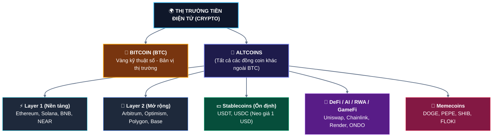
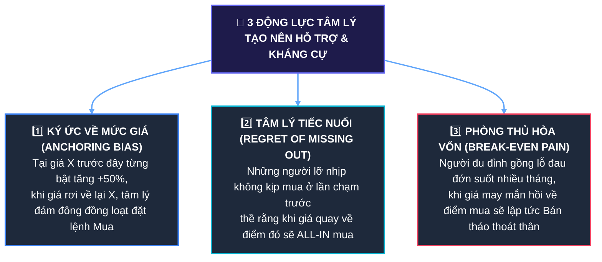
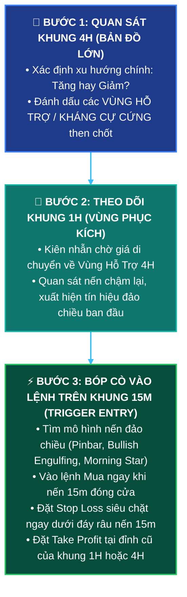
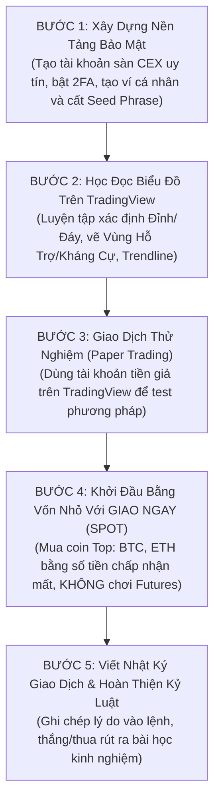

# 📘 GIÁO TRÌNH NHẬP MÔN TIỀN ĐIỆN TỬ (CRYPTO) & PHÂN TÍCH KỸ THUẬT TỪ A - Z
> **Dành riêng cho người mới bắt đầu (Beginner to Intermediate)**  
> *Tài liệu biên soạn chi tiết, dễ hiểu, trực quan với mô hình nến, phân tích đa khung thời gian 4H - 1H - 15m và chiến lược thực chiến đỉnh cao.*

---

## 📑 MỤC LỤC
1. [Chương 1: Bản Chất Tiền Điện Tử & Blockchain Là Gì?](#chương-1-bản-chất-tiền-điện-tử--blockchain-là-gì)
2. [Chương 2: Phân Loại Coin, Ví Lưu Trữ & Sàn Giao Dịch](#chương-2-phân-loại-coin-ví-lưu-trữ--sàn-giao-dịch)
3. [Chương 3: Bản Chất Thị Trường & Biểu Đồ Nến Nhật (Candlestick)](#chương-3-bản-chất-thị-trường--biểu-đồ-nến-nhật-candlestick)
4. [Chương 4: Các Mô Hình Nến Đảo Chiều Quan Trọng (Kèm Minh Họa Trực Quan)](#chương-4-các-mô-hình-nến-đảo-chiều-quan-trọng-kèm-minh-họa-trực-quan)
5. [Chương 5: Vùng Hỗ Trợ & Kháng Cự Chuyên Sâu (Support & Resistance)](#chương-5-vùng-hỗ-trợ--kháng-cự-chuyên-sâu-support--resistance)
6. [Chương 6: Cấu Trúc Thị Trường & Xu Hướng (Market Structure & Trend)](#chương-6-cấu-trúc-thị-trường--xu-hướng-market-structure--trend)
7. [Chương 7: CHUYÊN ĐỀ ĐA KHUNG THỜI GIAN: PHÂN BIỆT 4H - 1H - 15M, CÁCH XÁC ĐỊNH ĐỈNH ĐÁY & CHIẾN LƯỢC THỰC CHIẾN](#chương-7-chuyên-đề-đa-khung-thời-gian-phân-biệt-4h---1h---15m-cách-xác-định-đỉnh-đáy--chiến-lược-thực-chiến)
8. [Chương 8: Khối Lượng Giao Dịch (Volume) & Các Chỉ Báo Kỹ Thuật Cơ Bản](#chương-8-khối-lượng-giao-dịch-volume--các-chỉ-báo-kỹ-thuật-cơ-bản)
9. [Chương 9: Quản Lý Vốn & Tâm Lý Giao Dịch (Nguyên Tắc Sống Còn)](#chương-9-quản-lý-vốn--tâm-lý-giao-dịch-nguyên-tắc-sống-còn)
10. [Chương 10: Từ Điển Thuật Ngữ Crypto Thông Dụng Nhất](#chương-10-từ-điển-thuật-ngữ-crypto-thông-dụng-nhất)
11. [Chương 11: Lộ Trình 5 Bước Thực Hành An Toàn Cho Người Mới](#chương-11-lộ-trình-5-bước-thực-hành-an-toàn-cho-người-mới)

---

# CHƯƠNG 1: BẢN CHẤT TIỀN ĐIỆN TỬ & BLOCKCHAIN LÀ GÌ?

## 1.1. Tiền điện tử (Cryptocurrency) là gì?
**Tiền điện tử** (tiền mã hóa / crypto) là loại tài sản kỹ thuật số được thiết kế để hoạt động như một phương tiện trao đổi, lưu trữ giá trị hoặc thực thi hợp đồng thông minh. Nó không chịu sự kiểm soát của bất kỳ chính phủ, ngân hàng trung ương hay tổ chức đơn lẻ nào.

### 📊 So sánh Tiền Pháp Định (Fiat) vs Tiền Điện Tử (Crypto)

| Đặc Điểm | 🏦 Tiền Pháp Định (VND, USD, EUR...) | 🌐 Tiền Điện Tử (Bitcoin, Ethereum...) |
| :--- | :--- | :--- |
| **Cơ quan phát hành** | 🏛️ Ngân hàng Trung ương / Chính phủ | ⚙️ Thuật toán mã hóa phi tập trung |
| **Nguồn cung** | ⚠️ Không giới hạn (có thể in thêm gây lạm phát) | 🔒 Thường có giới hạn (Ví dụ: BTC tối đa 21 triệu) |
| **Kiểm duyệt & Đóng băng** | 🚫 Tài khoản có thể bị ngân hàng phong tỏa | 🛡️ Không ai phong tỏa được ví cá nhân của bạn |
| **Tốc độ giao dịch quốc tế** | ⏳ 1 - 5 ngày làm việc, phí cao | ⚡ Vài giây đến vài phút, phí rẻ, 24/7 |
| **Tính minh bạch** | 🔒 Hệ thống nội bộ ngân hàng (đóng) | 🔍 Sổ cái công khai trên Blockchain (ai cũng xem được) |

---

## 1.2. Công nghệ Blockchain hoạt động như thế nào?
Hãy tưởng tượng **Blockchain** giống như một **"Cuốn sổ cái kế toán công cộng"**:
- Bất kỳ ai gửi tiền cho ai đều được ghi vào một trang sổ (**Block** - Khối).
- Khi trang sổ đầy, nó được đóng dấu niêm phong bằng thuật toán mã hóa phức tạp và móc nối vào trang trước đó tạo thành một chuỗi (**Chain** - Chuỗi).
- Bản sao cuốn sổ này được lưu trữ đồng thời trên hàng chục nghìn máy tính (**Nodes**) khắp thế giới.

```mermaid
%%{init: {'theme': 'base', 'themeVariables': { 'primaryColor': '#1e293b', 'primaryTextColor': '#ffffff', 'primaryBorderColor': '#3b82f6', 'lineColor': '#94a3b8'}}}%%
flowchart LR
    A["💳 <b>BƯỚC 1</b><br/>Giao dịch mới phát sinh<br/><i>(A chuyển cho B)</i>"] 
    B["📦 <b>BƯỚC 2</b><br/>Giao dịch được gom<br/>vào Khối (Block)"] 
    C["💻 <b>BƯỚC 3</b><br/>Các máy tính (Nodes)<br/>xác thực thuật toán"] 
    D["⛓️ <b>BƯỚC 4</b><br/>Khối khóa mã hóa &<br/>nối vào Blockchain"] 
    E["✅ <b>BƯỚC 5</b><br/>Giao dịch hoàn tất<br/><i>(Không thể tẩy xóa/sửa)</i>"]

    A --> B --> C --> D --> E

    linkStyle default stroke:#60a5fa,stroke-width:2px;

    style A fill:#1e3a8a,stroke:#3b82f6,stroke-width:2px,color:#ffffff
    style B fill:#1e293b,stroke:#06b6d4,stroke-width:2px,color:#ffffff
    style C fill:#581c87,stroke:#a855f7,stroke-width:2px,color:#ffffff
    style D fill:#7c2d12,stroke:#f97316,stroke-width:2px,color:#ffffff
    style E fill:#064e3b,stroke:#22c55e,stroke-width:2px,color:#ffffff
```



```
┌────────────────────────┐      ┌────────────────────────┐      ┌────────────────────────┐
│     BLOCK #101         │      │     BLOCK #102         │      │     BLOCK #103         │
├────────────────────────┤      ├────────────────────────┤      ├────────────────────────┤
│ Hash: 000abc45f89...   │ <─── │ Hash: 000def78a12...   │ <─── │ Hash: 000xyz99c34...   │
│ PrevHash: 000999aa1... │      │ PrevHash: 000abc45f89..│      │ PrevHash: 000def78a12..│
│ Data: Alice -> Bob 1BTC│      │ Data: Bob -> Charlie 0.5│     │ Data: Dan -> Eva 2 BTC │
└────────────────────────┘      └────────────────────────┘      └────────────────────────┘
```

---

# CHƯƠNG 2: PHÂN LOẠI COIN, VÍ LƯU TRỮ & SÀN GIAO DỊCH

## 2.1. Phân loại các đồng coin trong thị trường



---

## 2.2. Ví lưu trữ Crypto: Ví Nóng vs Ví Lạnh

```
  ┌──────────────────────────────────────────────────┐      ┌──────────────────────────────────────────────────┐
  │              🔥 VÍ NÓNG (HOT WALLET)             │      │              🧊 VÍ LẠNH (COLD WALLET)            │
  ├──────────────────────────────────────────────────┤      ├──────────────────────────────────────────────────┤
  │ • Kết nối trực tiếp Internet (App/Extension)     │      │ • Thiết bị phần cứng riêng biệt, ngắt Internet   │
  │ • Tiện lợi giao dịch DeFi hàng ngày, phí 0đ      │      │ • Độ an toàn tối đa chống hacker xâm nhập        │
  │ • Rủi ro: Dễ bị dính link phishing lừa đảo       │      │ • Thích hợp lưu trữ tài sản lớn lâu dài (HODL)   │
  │ • Đại diện: MetaMask, Phantom, Trust Wallet, Rabby│     │ • Đại diện: Ledger Nano X, Trezor, SafePal S1    │
  └──────────────────────────────────────────────────┘      └──────────────────────────────────────────────────┘
```

> [!CAUTION]
> **QUY TẮC SỐNG CÒN VỀ BẢO MẬT (SEED PHRASE):**  
> Khi tạo ví cá nhân, bạn sẽ nhận được **12 hoặc 24 từ tiếng Anh** (gọi là *Private Key / Seed Phrase*).
> - **KHÔNG BAO GIỜ** chụp ảnh màn hình, lưu trên Cloud (iCloud/Google Drive/Email/Zalo).
> - **HÃY VIẾT RA GIẤY** và cất ở nơi bí mật, chống ẩm, chống cháy.
> - Bất kỳ ai có được 12 từ này đều có thể rút sạch 100% tiền trong ví của bạn!

---

## 2.3. Sàn giao dịch: CEX vs DEX và Spot vs Futures

### A. CEX (Sàn Tập Trung) vs DEX (Sàn Phi Tập Trung)
- **CEX (Binance, OKX, Bybit...)**: Do công ty quản lý, đăng ký bằng email/KYC, dễ sử dụng, nạp rút tiền qua ngân hàng (P2P), tính thanh khoản cao.
- **DEX (Uniswap, PancakeSwap, Raydium...)**: Giao dịch trực tiếp từ ví cá nhân thông qua Smart Contract, không cần KYC danh tính.

### B. Giao dịch Giao Ngay (Spot) vs Hợp Đồng Tương Lai (Futures)
- **Spot (Giao ngay)**: Mua đồng coin thực tế và nắm giữ nó. Bạn chỉ lãi khi giá tăng. Nếu giá giảm, bạn không bị mất số lượng coin (chỉ giảm giá trị quy đổi), không bao giờ bị cháy tài khoản.
- **Futures (Hợp đồng tương lai / Phái sinh)**: Dự đoán giá tăng (**Long**) hoặc giảm (**Short**) kèm **Đòn bẩy (Leverage x2, x10, x100)**. Lợi nhuận cao đi kèm rủi ro **cháy sạch tài khoản (thanh lý)** nếu giá đi ngược dự đoán.

---

# CHƯƠNG 3: BẢN CHẤT THỊ TRƯỜNG & BIỂU ĐỒ NẾN NHẬT (CANDLESTICK)

## 3.1. Bản chất vận động của giá trên thị trường
Giá cả của một đồng coin không tăng giảm ngẫu nhiên. Nó là kết quả của **Cuộc chiến Cung - Cầu**:
- **Phe Mua (Bulls - Bò)**: Muốn đẩy giá đi lên. Khi Cầu > Cung $\rightarrow$ Giá TĂNG.
- **Phe Bán (Bears - Gấu)**: Muốn ép giá đi xuống. Khi Cung > Cầu $\rightarrow$ Giá GIẢM.
- **Trạng thái cân bằng (Sideway)**: Hai bên giằng co ngang ngửa.

---

## 3.2. Cấu tạo giải phẫu chi tiết của một cây Nến Nhật (OHLC)

Mỗi cây nến thể hiện hành vi giá trong một khung thời gian nhất định (1 Phút, 15 Phút, 1 Giờ, 4 Giờ, 1 Ngày...):
- **O (Open)**: Giá Mở Cửa trong phiên.
- **H (High)**: Giá Cao Nhất đạt được trong phiên.
- **L (Low)**: Giá Thấp Nhất chạm tới trong phiên.
- **C (Close)**: Giá Đóng Cửa khi kết thúc phiên.

```
          🟢 NẾN TĂNG (BULLISH)                            🔴 NẾN GIẢM (BEARISH)
         (Giá Đóng Cửa > Mở Cửa)                          (Giá Đóng Cửa < Mở Cửa)

                     │ <-- Giá Cao Nhất (High)                        │ <-- Giá Cao Nhất (High)
                     │     (Đỉnh râu nến trên)                        │     (Đỉnh râu nến trên)
             ┌───────┴───────┐                                ┌───────┴───────┐
             │               │ <-- Giá Đóng Cửa (Close)       │               │ <-- Giá Mở Cửa (Open)
             │   THÂN NẾN    │                                │   THÂN NẾN    │
             │    (BODY)     │                                │    (BODY)     │
             │   MÀU XANH    │                                │    MÀU ĐỎ     │
             │               │ <-- Giá Mở Cửa (Open)          │               │ <-- Giá Đóng Cửa (Close)
             └───────┬───────┘                                └───────┬───────┘
                     │     (Đáy râu nến dưới)                         │     (Đáy râu nến dưới)
                     │ <-- Giá Thấp Nhất (Low)                        │ <-- Giá Thấp Nhất (Low)
```

---

## 3.3. TẠI SAO nến lại hình thành như vậy? (Tâm lý học đằng sau nến)

```
TRƯỜNG HỢP 1: THÂN DÀI ĐẶC                     TRƯỜNG HỢP 2: RÂU TRÊN DÀI                   TRƯỜNG HỢP 3: RÂU DƯỚI DÀI
(Lực mua áp đảo hoàn toàn)                     (Phe mua thất bại, bị xả mạnh)               (Phe bán bị từ chối, lực gom đáy)

           │                                                 │                                            │
    ┌──────┴──────┐                                          │ (Râu trên dài)                             │
    │             │                                          │                                     ┌──────┴──────┐
    │             │                                   ┌──────┴──────┐                              │             │
    │  XANH ĐẶC   │                                   │  Thân nhỏ   │                              └──────┬──────┘
    │             │                                   └──────┬──────┘                                     │
    │             │                                          │                                            │ (Râu dưới dài)
    └──────┬──────┘                                          │                                            │
           │                                                                                              │
```

1. **Thân nến lớn, râu nến rất ngắn (Marubozu)**: Một phe nắm quyền kiểm soát 100% từ đầu đến cuối phiên. Nếu là nến xanh đặc, phe mua đẩy giá thẳng tắp không cho phe bán ngóc đầu dậy.
2. **Râu nến trên dài (Long Upper Shadow)**: Ban đầu trong phiên, phe mua rất hăng hái đẩy giá lên cực cao (High). Tuy nhiên khi lên tới đỉnh, phe bán ồ ạt xả hàng đè bẹp phe mua, ép giá đóng cửa lùi sâu xuống dưới. $\rightarrow$ **Dấu hiệu lực mua đã kiệt sức!**
3. **Râu nến dưới dài (Long Lower Shadow)**: Ban đầu phe bán tấn công dữ dội ép giá rơi về đáy (Low). Nhưng tại đây xuất hiện một lượng tiền lớn của "cá mập" hoặc phe mua bắt đáy gom hàng, đẩy giá bật ngược trở lại. $\rightarrow$ **Dấu hiệu lực bán bị từ chối!**

---

# CHƯƠNG 4: CÁC MÔ HÌNH NẾN ĐẢO CHIỀU QUAN TRỌNG

## 4.1. Nhóm Nến Đơn Đảo Chiều

### A. Nến Hammer (Nến Búa) - Đảo Chiều Tăng Giá ở Đáy
```
       Xu hướng giảm
       ╲
        ╲
         ╲        ┌───┐
          ╲       │   │ <-- Thân nến nhỏ ở trên
           ╲      └──┬┘
                     │
                     │ <-- Râu dưới dài gấp 2-3 lần thân (Lực bắt đáy mạnh)
                     │
                     ▼
             ==> ĐẢO CHIỀU TĂNG GIÁ ↗ (Đặt Buy, SL dưới đáy râu nến)
```

---

### B. Nến Shooting Star (Sao Băng) - Đảo Chiều Giảm Giá ở Đỉnh
```
                     ▲
                     │
                     │ <-- Râu trên rất dài (Bị xả hàng cực mạnh)
                     │
                  ┌──┴┐
                  │   │ <-- Thân nến nhỏ ở đáy
                 ╱└───┘
                ╱
               ╱
        Xu hướng tăng
             ==> ĐẢO CHIỀU GIẢM GIÁ ↘ (Đặt Sell/Chốt lời, SL trên đỉnh râu nến)
```

---

### C. Các Loại Nến Doji (Nến Lưỡng Lự & Biến Thể)
```
   1. DOJI CHUẨN (Lưỡng lự)        2. DRAGONFLY (Chuồn Chuồn)        3. GRAVESTONE (Bia Mộ)
     (Cân bằng mua - bán)           (Đảo chiều Tăng ở Đáy)            (Đảo chiều Giảm ở Đỉnh)

              │                                                                 │
              │                                                                 │
         ─────┼─────                     ─────────┼─────────                    │
              │                                   │                        ─────┴─────
              │                                   │
```

---

## 4.2. Nhóm Mô Hình Đa Nến Siêu Mạnh

### A. Mô Hình Nến Nhấn Chìm Tăng (Bullish Engulfing) & Giảm (Bearish Engulfing)
```
      BULLISH ENGULFING (Nhấn chìm TĂNG)            BEARISH ENGULFING (Nhấn chìm GIẢM)
              (Tín hiệu MUA MẠNH)                          (Tín hiệu BÁN MẠNH)

               │                                                   │      ┌───┴───┐
             ┌─┴─┐      ┌───┴───┐                                ┌─┴─┐    │       │
             │ ĐỎ│  <   │       │                                │XANH<   │  ĐỎ   │
             │   │      │ XANH  │                                │   │    │       │
             └─┬─┘      │ (BODY │                                └─┬─┘    │       │
               │        │  TRÙM)│                                  │      └───┬───┘
                        └───┬───┘                                             │
                            │
        [Nến 2 Xanh nuốt chửng Nến 1 Đỏ]             [Nến 2 Đỏ nuốt chửng Nến 1 Xanh]
```

---

### B. Mô hình Sao Mai (Morning Star) & Sao Hôm (Evening Star)
```
        MORNING STAR (Mô hình SAO MAI)                   EVENING STAR (Mô hình SAO HÔM)
         (Cụm 3 nến đảo chiều TĂNG GIÁ)                  (Cụm 3 nến đảo chiều GIẢM GIÁ)

              Nến 1: Giảm mạnh (Đỏ)                                    Nến 2: Nến nhỏ / Doji
              Nến 2: Nến nhỏ / Doji ở đáy                                      ┌─┴─┐
              Nến 3: Tăng mạnh (Xanh) (>50% nến 1)                             └──┬┘
                                                                                  │
             │                                                          │                   │
           ┌─┴─┐                 │                                    ┌─┴─┐               ┌─┴─┐
           │ ĐỎ│               ┌─┴─┐                                  │XANH               │ ĐỎ│
           │   │               │XANH                                  │   │               │   │
           └─┬─┘     ┌─┴─┐     │   │                                  └─┬─┘               └─┬─┘
             │       └──┬┘     └───┘                                    │                   │
                                                                   Nến 1: Tăng mạnh    Nến 3: Giảm mạnh
```

---

# CHƯƠNG 5: VÙNG HỖ TRỢ & KHÁNG CỰ CHUYÊN SÂU (SUPPORT & RESISTANCE)

## 5.1. Bản chất cốt lõi: Hỗ Trợ là gì? Kháng Cự là gì?
- **Vùng Hỗ Trợ (Support - S)**: Là vùng giá nằm bên dưới mà tại đó lực CẦU (Phe Mua) tập trung số lượng lớn lệnh chờ mua (Buy Limit). Khi giá rơi về đây, lực mua đủ sức hấp thụ toàn bộ lực xả và đẩy giá bật tăng trở lại. Được ví như **"Mặt Sàn Đỡ Giá"**.
- **Vùng Kháng Cự (Resistance - R)**: Là vùng giá nằm bên trên mà tại đó áp lực CUNG (Phe Bán) tập trung số lượng lớn lệnh chờ bán (Sell Limit) và chốt lời. Khi giá tăng lên đây, áp lực bán đè bẹp lực mua khiến giá quay đầu sập xuống. Được ví như **"Trần Nhà Chặn Giá"**.

```
═══════════════════════════════════════════════════════════════ 🔴 VÙNG KHÁNG CỰ (Trần Nhà - Bán ra)
                 ▲                      ▲
                ╱ ╲                    ╱ ╲
               ╱   ╲                  ╱   ╲
              ╱     ╲                ╱     ╲
             ╱       ╲              ╱       ╲
            ╱         ▼            ╱         ▼
═══════════════════════════════════════════════════════════════ 🟢 VÙNG HỖ TRỢ (Mặt Sàn - Mua vào)
```

---

## 5.2. TẠI SAO lại hình thành Vùng Hỗ Trợ và Kháng Cự? (Tâm lý học hành vi)



> [!IMPORTANT]
> 💡 **NGUYÊN TẮC VÀNG:** Hỗ trợ & Kháng cự là **VÙNG GIÁ (ZONE)**, KHÔNG PHẢI một đường kẻ mỏng manh duy nhất!  
> Thị trường luôn có sự giằng co và độ nhiễu. Hãy luôn dùng công cụ hộp chữ nhật trên TradingView để bao trọn cả thân nến lẫn râu nến của các đỉnh/đáy.

---

## 5.3. 4 Cách Xác Định Vùng Hỗ Trợ & Kháng Cự Chuẩn Xác Nhất

```
┌─────────────────────────────────────────────────────────────────────────────────────────────┐
│ 1. ĐỈNH VÀ ĐÁY LỊCH SỬ (SWING HIGH / SWING LOW)                                             │
│    • Đáy cũ trong quá khứ -> Vùng Hỗ Trợ tiềm năng trong tương lai.                         │
│    • Đỉnh cũ trong quá khứ -> Vùng Kháng Cự tiềm năng trong tương lai.                      │
├─────────────────────────────────────────────────────────────────────────────────────────────┤
│ 2. VÙNG NÉN GIÁ GIẰNG CO (CONSOLIDATION / ORDER BLOCK)                                      │
│    • Nơi giá từng tích lũy đi ngang nhiều phiên trước khi bùng nổ tăng/giảm cực mạnh.        │
│    • Đây chính là nơi "Cá mập" gom hàng hoặc xả hàng với khối lượng (Volume) khổng lồ.      │
├─────────────────────────────────────────────────────────────────────────────────────────────┤
│ 3. CÁC MỐC SỐ TRÒN TÂM LÝ (PSYCHOLOGICAL ROUND NUMBERS)                                     │
│    • Con người có thói quen đặt lệnh ở các con số tròn trịa: 20,000$, 50,000$, 100,000$ BTC.│
│    • Lượng lệnh limit tập trung tại đây tạo thành bức tường cản tự nhiên.                   │
├─────────────────────────────────────────────────────────────────────────────────────────────┤
│ 4. HỖ TRỢ & KHÁNG CỰ ĐỘNG (DYNAMIC S/R)                                                    │
│    • Các đường trung bình động lớn: EMA50, EMA200 hoặc Đường Trendline chéo.                │
└─────────────────────────────────────────────────────────────────────────────────────────────┘
```

---

## 5.4. Quy tắc chuyển đổi vai trò (Role Reversal)
Khi một vùng cản bị xuyên thủng với lực mua/bán mạnh kèm Volume lớn:
- 🔄 **Kháng Cự cũ bị đục thủng $\rightarrow$ Biến thành Hỗ Trợ mới**.
- 🔄 **Hỗ Trợ cũ bị đâm gãy $\rightarrow$ Biến thành Kháng Cự mới**.

```
                                                      Phá vỡ (Breakout)
                                                             ▲
                                                    ────────╱────────────── 🔴 VÙNG KHÁNG CỰ CŨ
                                                   ╱       ╱  ▲
                                                  ╱       ╱  ╱ (Retest kiểm tra lại)
                                                 ╱       ▼  ╱
  ─────────────────────────────────────────────╱─────────────────────────── 🟢 BIẾN THÀNH HỖ TRỢ MỚI
         ▲                    ▲               ╱
        ╱ ╲                  ╱ ╲             ╱
       ╱   ╲                ╱   ╲           ╱
      ╱     ╲              ╱     ╲         ╱
     ╱       ▼            ╱       ▼       ╱
    ╱         ╲          ╱         ╲     ╱
   ▼           ▼        ▼           ▼   ╱
  ═════════════════════════════════════╱════════════════════════════════════ 🟢 HỖ TRỢ BAN ĐẦU
```

---

## 5.5. Phân biệt Phá Vỡ Thật (Breakout) vs Phá Vỡ Giả (Fakeout / Trap)

```
        🟢 BREAKOUT THẬT (Có Retest + Volume Lớn)             🔴 FAKEOUT / BULL TRAP (Bẫy Tăng Giá)
                    ▲                                                     ▲ (Thò râu lên dụ mua)
                   ╱                                                     ╱ ╲
                  ╱ (Tiếp tục tăng)                                     ╱   ╲
           ──────╱───▲──────────────── Kháng Cự                  ──────╱─────╲──────── Kháng Cự
          ╱     ╱   ╱                                           ╱     ▼       ╲ (Rơi ngược lại)
         ╱     ▼   ╱ (Retest thành công)                       ╱               ▼
        ╱       ▼ ╱                                           ╱
```

- **Mẹo xử lý**: Đừng vội mua đuổi ngay khi thấy nến vừa vượt qua cản. Hãy kiên nhẫn đợi cây nến đóng cửa hoàn toàn và đợi nhịp **Kiểm tra lại (Retest)** về vùng cản với khối lượng thấp rồi mới vào lệnh!

---

# CHƯƠNG 6: CẤU TRÚC THỊ TRƯỜNG & XU HƯỚNG (MARKET STRUCTURE & TREND)

Có câu châm ngôn kinh điển: **"Trend is your Friend" (Xu hướng là bạn đồng hành)**.

## 6.1. Ba trạng thái của cấu trúc thị trường

```
🟢 1. UPTREND (Xu hướng Tăng)         🔴 2. DOWNTREND (Xu hướng Giảm)       ⚪ 3. SIDEWAY (Đi ngang)
   - Đỉnh sau cao hơn (HH)               - Đỉnh sau thấp hơn (LH)              - Đỉnh và Đáy bằng nhau
   - Đáy sau cao hơn (HL)                 - Đáy sau thấp hơn (LL)

            HH2                                 LH1                                 R     R     R
           ╱  ╲                                ╱  ╲                                ───   ───   ───
     HH1  ╱    ╲                              ╱    ╲     LH2                      ╱   ╲ ╱   ╲ ╱   ╲
    ╱  ╲ ╱      ╲                            ╱      ╲   ╱  ╲                     ╱     ╳     ╳     ╲
   ╱    HL2      ▼                          ▼        LL1    ╲                   ───   ───   ───
  ╱    HL1                                                   ▼                       S     S     S
 ╱                                                             LL2
HL0
```
- 🟢 **HH (Higher High)**: Đỉnh cao hơn đỉnh trước.
- 🟢 **HL (Higher Low)**: Đáy cao hơn đáy trước $\rightarrow$ Thể hiện phe mua liên tục nâng giá sàn đỡ thị trường.
- 🔴 **LH (Lower High)**: Đỉnh thấp hơn đỉnh trước.
- 🔴 **LL (Lower Low)**: Đáy thấp hơn đáy trước $\rightarrow$ Thể hiện phe bán liên tục dìm giá lập đáy mới.

---

# CHƯƠNG 7: CHUYÊN ĐỀ ĐA KHUNG THỜI GIAN: PHÂN BIỆT 4H - 1H - 15M, CÁCH XÁC ĐỊNH ĐỈNH ĐÁY & CHIẾN LƯỢC THỰC CHIẾN

> [!IMPORTANT]
> Đây là phần kiến thức **cốt lõi và quan trọng bậc nhất** giúp người mới thoát khỏi cái bẫy "loạn chưởng" khi nhìn biểu đồ ở các khung giờ khác nhau.

---

## 7.1. Bản chất của các khung thời gian (Timeframes - TF) là gì?

Mỗi khung thời gian đại diện cho thời gian hình thành của **1 cây nến**:
- Trên khung **4H (4 Giờ)**: 1 cây nến mất đúng 4 tiếng đồng hồ để đóng cửa.
- Trên khung **1H (1 Giờ)**: 1 cây nến mất đúng 60 phút để đóng cửa.
- Trên khung **15M (15 Phút)**: 1 cây nến mất đúng 15 phút để đóng cửa.

### Tính chất Phân Mảnh (Fractal Nature - Sóng trong sóng):
Một cây nến khung lớn thực chất được ghép lại từ nhiều cây nến khung nhỏ hơn:

```
  ┌─────────────────────────────────────────────────────────────────────────────┐
  │ 🌟 QUY TẮC GHÉP NẾN LIÊN KHUNG:                                             │
  │ • 1 cây nến 4H  =  4 cây nến 1H  =  16 cây nến 15M = 48 cây nến 5M        │
  │ • 1 cây nến 1D  =  6 cây nến 4H  =  24 cây nến 1H                          │
  └─────────────────────────────────────────────────────────────────────────────┘
```

```
                     KHUNG 4H: 1 NẾN TĂNG ĐƠN LẺ
                                ┌───┐
                                │   │
                                │   │
                                └───┘
                                  │
                                  ▼
                     KHUNG 1H: 4 CÂY NẾN ĐI LÊN
                    ┌───┐   ┌───┐
            ┌───┐   │   │   │   │
            │   │   │   │   └───┘
            └───┘   └───┘
              │
              ▼
                     KHUNG 15M: MỘT XU HƯỚNG TĂNG HOÀN CHỈNH
                          (Gồm nhiều Đỉnh HH và Đáy HL lồng ghép)
                            HH2
                           ╱  ╲
                     HH1  ╱    ╲
                    ╱  ╲ ╱      ╲
                   ╱    HL2      ▼
                  ╱    HL1
                 HL0
```

---

## 7.2. So sánh chi tiết: Khung 4H vs 1H vs 15m có gì khác nhau?

| Tiêu Chí So Sánh | 🐘 Khung 4H (Khung Lớn - H4) | 🏃 Khung 1H (Khung Trung - H1) | ⚡ Khung 15m (Khung Nhỏ - M15) |
| :--- | :--- | :--- | :--- |
| **Vai trò chính** | **Bản đồ định hướng xu hướng lớn** | **Xác định cấu trúc & vùng phục kích** | **Tìm điểm bóp cò vào lệnh (Entry)** |
| **Độ tin cậy của tín hiệu** | ⭐⭐⭐⭐⭐ Cực kỳ uy tín, rất ít nhiễu | ⭐⭐⭐⭐ Khá cao, cân bằng tốt | ⭐⭐ Nhiều tín hiệu giả (Fakeout/Nhiễu) |
| **Tần suất xuất hiện tín hiệu**| Ít (vài ngày mới có 1 cơ hội) | Vừa phải (1-2 cơ hội/ngày) | Rất nhiều (vài chục cơ hội mỗi ngày) |
| **Biên độ biến động giá** | Rất lớn (5% - 20%+) | Trung bình (2% - 8%) | Nhỏ (0.5% - 2%) |
| **Khoảng cách Cắt lỗ (Stoploss)**| Rộng (cần vốn chịu đựng lớn) | Vừa phải | Rất hẹp / Siêu chặt (Tối ưu tỷ lệ R:R) |
| **Thời gian nắm giữ lệnh** | Vài ngày đến vài tuần (Swing Trading)| Trong ngày đến qua đêm (Day Trading)| 15 phút đến vài giờ (Scalping) |
| **Tác động tâm lý** | Nhẹ nhàng, ít phải canh biểu đồ | Vừa phải | Áp lực cao, dễ bị cuốn vào FOMO |

---

## 7.3. Cách xác định Đỉnh và Đáy (Swing High / Swing Low) theo từng khung giờ

### A. Quy tắc kỹ thuật chuẩn để nhận diện Đỉnh / Đáy (Fractal Rule)
Không phải cây nến nào nhô lên cũng là Đỉnh, và không phải cây nến nào cắm xuống cũng là Đáy. Một Đỉnh/Đáy chuẩn phải thỏa mãn:

```
          🎯 QUY TẮC XÁC NHẬN ĐỈNH (SWING HIGH)             🎯 QUY TẮC XÁC NHẬN ĐÁY (SWING LOW)
         (Nến Đỉnh cao hơn ít nhất 2 nến hai bên)          (Nến Đáy thấp hơn ít nhất 2 nến hai bên)

                         ┌───┐                                      ┌───┐       ┌───┐
                         │ 3 │ <-- ĐỈNH (HIGHEST)                   │ 1 │       │ 5 │
                 ┌───┐   └──┬┘   ┌───┐                              └──┬┘ ┌───┐ └──┬┘
                 │ 2 │      │    │ 4 │                                 │  │ 2 │    │
         ┌───┐   └──┬┘      │    └──┬┘   ┌───┐                            └──┬┘
         │ 1 │      │       │       │    │ 5 │                               │    ┌───┐
         └──┬┘      │       │       │    └──┬┘                                    │ 4 │
            │       │       │       │       │                                     └──┬┘
                                                                            ┌───┐    │
                                                                            │ 3 │ <-- ĐÁY (LOWEST)
                                                                            └───┘
```
- **Xác nhận Đỉnh (Swing High)**: Cây nến số 3 có giá cao nhất ($High$), được kẹp giữa bởi 2 cây nến bên trái thấp hơn và 2 cây nến bên phải thấp hơn.
- **Xác nhận Đáy (Swing Low)**: Cây nến số 3 có giá thấp nhất ($Low$), được kẹp giữa bởi các nến có đáy cao hơn ở hai bên.

---

### B. Sự khác nhau giữa Đỉnh/Đáy của 4H, 1H và 15M

```
┌─────────────────────────────────────────────────────────────────────────────────────────────┐
│ 1. ĐỈNH / ĐÁY TRÊN KHUNG 4H (MAJOR SWINGS - ĐỈNH ĐÁY CỨNG)                                  │
│    • Được tạo nên bởi dòng tiền của các quỹ lớn, tổ chức tài chính (Whales/Institutions).   │
│    • Cần hàng trăm triệu USD để phá vỡ đỉnh/đáy 4H.                                         │
│    • Cực kỳ vững chắc: Giá chạm vào thường phản ứng bật ngược lại rất mạnh.                 │
├─────────────────────────────────────────────────────────────────────────────────────────────┤
│ 2. ĐỈNH / ĐÁY TRÊN KHUNG 1H (INTERMEDIATE SWINGS - ĐỈNH ĐÁY TRUNG GIAN)                     │
│    • Kết nối giữa xu hướng lớn 4H và nhịp sóng nhỏ 15m.                                     │
│    • Thích hợp để xác định các mốc cấu trúc BOS (Break of Structure) trong ngày.            │
├─────────────────────────────────────────────────────────────────────────────────────────────┤
│ 3. ĐỈNH / ĐÁY TRÊN KHUNG 15M (MINOR SWINGS - ĐỈNH ĐÁY PHỤ / DỄ BỊ PHÁ)                      │
│    • Thay đổi liên tục theo từng giờ, rất dễ bị quét râu (Stop Hunt / Liquidity Grab).      │
│    • Đỉnh/đáy 15m KHÔNG THỂ cản được xu hướng của 4H!                                       │
│    • Ví dụ: Nếu 4H đang Giảm dốc, một mô hình 2 đáy trên 15m rất dễ bị đâm thủng ngay lập tức.│
└─────────────────────────────────────────────────────────────────────────────────────────────┘
```

---

## 7.4. Mối quan hệ xung đột xu hướng giữa các khung giờ (Hiện tượng thường gặp)

Người mới thường hay hoang mang:  
> *"Tại sao khung 4H đang Uptrend tăng rất đẹp, nhưng mở khung 15m ra lại thấy nến đỏ sập liên tục (Downtrend)?"*

```
   KHUNG 4H (XU HƯỚNG CHÍNH LÀ TĂNG):
   Đáy 4H ───────────────────────────────────────────────────────────► Đỉnh 4H
       ▲                                                                   ▲
       │          NHỊP HỒI ĐIỀU CHỈNH CỦA 4H                               │
       │         (Chính là một DOWNTREND hoàn chỉnh trên 15M)              │
       │                                                                   │
       │            LH1 (15m)                                              │
       │            ╱  ╲                                                   │
       │           ╱    ╲     LH2 (15m)                                    │
       │          ╱      ╲   ╱  ╲                                          │
       │         ▼        LL1    ╲                                         │
       │                          ▼                                        │
       │                           LL2 (15m) ───► Chạm Hỗ Trợ 4H           │
       │                                          (Sau đó Bật Tăng Lại!)    │
       └───────────────────────────────────────────────────────────────────┘
```

- **Bản chất**: Xu hướng giảm trên khung 15m thực chất chỉ là một **Nhịp Sóng Hồi (Pullback / Retracement)** lành mạnh của khung 4H để đón thêm lực mua trước khi tiếp tục chu kỳ tăng lớn!

---

## 7.5. Chiến Lược Giao Dịch Phối Hợp 3 Khung Giờ (Top-Down Multi-Timeframe Strategy)

Đây là chiến lược chuẩn của các Pro Trader thế giới: **Phân tích từ trên xuống dưới (4H $\rightarrow$ 1H $\rightarrow$ 15M)**.



---

### 🏆 Kịch Bản Ví Dụ Thực Chiến Từng Bước (Buy Setup Hoàn Hảo):

```
+=============================================================================================+
| KỊCH BẢN THỰC CHIẾN GIAO DỊCH BITCOIN (BTC):                                                |
|                                                                                             |
| 1. KHUNG 4H:                                                                                |
|    - Cấu trúc 4H đang là UPTREND (Tạo đỉnh sau cao hơn HH, đáy sau cao hơn HL).             |
|    - Vùng Hỗ Trợ cứng 4H nằm tại mốc: 60,000$ - 60,500$.                                    |
|    - Giá BTC đang giảm hồi từ đỉnh 65,000$ về tiếp cận vùng 60,200$.                        |
|                                                                                             |
| 2. KHUNG 1H:                                                                                |
|    - Giá chạm vào vùng 60,200$ và bắt đầu xuất hiện các nến thân nhỏ (Lực xả cạn kiệt).     |
|                                                                                             |
| 3. KHUNG 15M (BÓP CÒ VÀO LỆNH):                                                             |
|    - Xuất hiện một cây nến HAMMER (Nến búa) rút chân cực dài tại giá 60,100$.                |
|    - Ngay sau đó là một cây nến XANH BULLISH ENGULFING nuốt trọn nến đỏ trước đó.           |
|                                                                                             |
| 4. THIẾT LẬP LỆNH GIAO DỊCH:                                                                |
|    - Điểm Mua (Entry): 60,300$ (khi nến 15m đóng cửa).                                      |
|    - Cắt Lỗ (Stop Loss): 59,950$ (dưới râu nến búa 15m, chỉ cách 350$ ~ 0.58%).             |
|    - Chốt Lời (Take Profit): 64,800$ (đỉnh cũ của khung 4H, cách 4,500$ ~ 7.46%).          |
|                                                                                             |
|    ==> TỶ LỆ R:R ĐẠT ĐƯỢC: 1 : 12.8 (Mất 1 đồng rủi ro nhưng Ăn tới gần 13 đồng lãi!)       |
+=============================================================================================+
```

---

## 7.6. Bảng Phân Loại Chiến Lược Theo Từng Phong Cách Giao Dịch

```
┌─────────────────┬───────────────────┬───────────────────┬───────────────────┬───────────────┐
│ Phong Cách      │ Khung Xu Hướng    │ Khung Cấu Trúc    │ Khung Vào Lệnh    │ Thời Gian Lệnh│
│ Giao Dịch       │ (Trend Frame)     │ (Setup Frame)     │ (Entry Frame)     │ Trung Bình    │
├─────────────────┼───────────────────┼───────────────────┼───────────────────┼───────────────┤
│ 🏄 SCALPING      │ Khung 1H          │ Khung 15m         │ Khung 1m hoặc 5m  │ 5p - 45 phút  │
│ (Lướt siêu ngắn)│                   │                   │                   │               │
├─────────────────┼───────────────────┼───────────────────┼───────────────────┼───────────────┤
│ ⏱️ DAY TRADING   │ Khung 4H          │ Khung 1H          │ Khung 15m         │ 2h - 24 giờ   │
│ (Trong ngày)    │ (Khuyên dùng nhất)│ (Khuyên dùng nhất)│ (Khuyên dùng nhất)│               │
├─────────────────┼───────────────────┼───────────────────┼───────────────────┼───────────────┤
│ 🌊 SWING TRADING │ Khung 1D (Ngày)   │ Khung 4H          │ Khung 1H          │ 3 ngày - 2 tuần│
│ (Theo con sóng) │                   │                   │                   │               │
├─────────────────┼───────────────────┼───────────────────┼───────────────────┼───────────────┤
│ 💎 POSITION     │ Khung 1W (Tuần)   │ Khung 1D          │ Khung 4H          │ Vài tháng đến │
│ / HODL Dài hạn  │                   │                   │                   │ hàng năm      │
└─────────────────┴───────────────────┴───────────────────┴───────────────────┴───────────────┘
```

---

# CHƯƠNG 8: KHỐI LƯỢNG GIAO DỊCH (VOLUME) & CÁC CHỈ BÁO KỸ THUẬT CƠ BẢN

## 8.1. Khối lượng giao dịch (Volume) - "Nhiên liệu của giá"
Volume thể hiện số lượng coin được trao tay trong một khung thời gian.
- **Giá tăng + Volume tăng vọt**: Xu hướng tăng cực kỳ vững chắc (Phe mua đồng thuận bơm tiền).
- **Giá tăng + Volume teo tóp (Phân kỳ Volume)**: Cảnh báo đà tăng suy kiệt, dễ đảo chiều sập bẫy.
- **Phá cản (Breakout) + Volume bùng nổ**: Xác nhận phá vỡ thật thành công.

---

## 8.2. Bộ 4 Chỉ Báo Kỹ Thuật Kinh Điển Dành Cho Người Mới

### 1. Đường Trung Bình Động (MA & EMA)
- **MA20 / MA50 / MA200**: Trung bình giá đóng cửa của 20, 50, 200 phiên.
- **Golden Cross (Giao cắt vàng)**: Đường MA ngắn hạn (ví dụ MA50) cắt lên trên MA dài hạn (MA200) $\rightarrow$ Tín hiệu chu kỳ Siêu Tăng Trưởng (Bullrun).
- **Death Cross (Giao cắt tử thần)**: MA ngắn hạn cắt xuống dưới MA dài hạn $\rightarrow$ Tín hiệu thị trường bước vào Mùa Đông Ảm Đạm (Bearmarket).

### 2. Chỉ Số Sức Mạnh Tương Đối (RSI - Relative Strength Index)
Thước đo giao động từ 0 đến 100:

```
  100 ┌─────────────────────────────────────────────────────────────┐
      │                                                             │
   70 ├╌╌╌╌╌╌╌╌╌╌╌╌╌╌╌╌╌╌╌╌╌╌╌╌╌╌╌╌╌╌╌╌╌╌╌╌╌╌╌╌╌╌╌╌╌╌╌╌╌╌╌╌╌╌╌╌╌╌╌┤ VÙNG QUÁ MUA (Overbought) -> Cân nhắc Chốt Lời
      │                   /\                                        │
      │                  /  \              /\                       │
   50 ├─────────────────/────\────────────/──\──────────────────────┤ VÙNG TRUNG TÍNH (50)
      │                       \          /    \                     │
      │                        \        /      \       /\           │
   30 ├╌╌╌╌╌╌╌╌╌╌╌╌╌╌╌╌╌╌╌╌╌╌╌╌╌\╌╌╌╌╌╌/╌╌╌╌╌╌╌╌\╌╌╌╌╌/╌╌\╌╌╌╌╌╌╌╌╌┤ VÙNG QUÁ BÁN (Oversold) -> Cơ hội Bắt Đáy
      │                          \/              \/                 │
    0 └─────────────────────────────────────────────────────────────┘
```

- **RSI > 70 (Vùng Quá Mua)**: Giá đã tăng quá nóng, rủi ro điều chỉnh giảm cao. Hạn chế mua đuổi.
- **RSI < 30 (Vùng Quá Bán)**: Giá đã bị bán tháo quá đà, lực xả cạn kiệt, dễ có sóng hồi phục.
- **Phân kỳ đảo chiều (Divergence)**: Giá tạo đáy mới thấp hơn (LL) nhưng RSI lại tạo đáy mới cao hơn (HL) $\rightarrow$ Tín hiệu nén lò xo chuẩn bị bật tăng cực mạnh!

### 3. MACD (Đường trung bình động hội tụ phân kỳ)
- Gồm đường **MACD Line**, đường **Signal Line** và thanh biểu đồ **Histogram**.
- Khi MACD Line cắt LÊN Signal Line $\rightarrow$ Mua.
- Khi MACD Line cắt XUỐNG Signal Line $\rightarrow$ Bán.

### 4. Dải Băng Bollinger Bands (BB)
- Gồm đường trục giữa (SMA20) và 2 dải biên trên (Upper Band), biên dưới (Lower Band).
- **Hiện tượng Thắt Cổ Chai (Squeeze)**: Khi 2 dải biên co thắt hẹp lại $\rightarrow$ Báo hiệu một cơn biến động giá cực lớn chuẩn bị bùng nổ!

---

# CHƯƠNG 9: QUẢN LÝ VỐN & TÂM LÝ GIAO DỊCH (NGUYÊN TẮC SỐNG CÒN)

Trong thị trường tài chính: **"Kiếm được tiền là việc của kỹ năng, nhưng GIỮ được tiền mới giúp bạn tồn tại"**. 95% người mới thua lỗ không phải vì phân tích kém, mà vì **quản lý vốn sai lầm và tâm lý yếu kém**.

```
                        ┌────────────────────────────────────────┐
                        │      TAM GIÁC THÀNH CÔNG TRONG CRYPTO   │
                        └───────────────────┬────────────────────┘
                                            │
                     ┌──────────────────────┴──────────────────────┐
                     ▼                                             ▼
          [ 50% TÂM LÝ GIAO DỊCH ]                     [ 30% QUẢN LÝ VỐN ]
      (Kiểm soát cảm xúc, kiên nhẫn,                (Quy tắc 1-2%, Tỷ lệ R:R,
       không FOMO, không trả thù)                     DCA, Cắt lỗ nghiêm ngặt)
                     │                                             │
                     └──────────────────────┬──────────────────────┘
                                            ▼
                                [ 20% PHÂN TÍCH KỸ THUẬT ]
                               (Đọc nến, vẽ cản, chỉ báo)
```

---

## 9.1. Quy tắc rủi ro 1% - 2% (Position Sizing)
> **Không bao giờ mạo hiểm quá 1% đến 2% tổng tài sản cho một lệnh duy nhất.**

- Ví dụ: Vốn của bạn là **$1,000**.
- Mức rủi ro tối đa 1 lệnh = **$1,000 x 1% = $10**.
- Nếu điểm cắt lỗ (Stop Loss) của bạn cách điểm vào lệnh 5%, thì khối lượng vào lệnh = $10 / 5% = **$200**.
- Nếu lệnh đó sai, bạn chỉ mất đúng $10 (tài khoản còn $990, bạn cần chuỗi thua 50 lệnh liên tiếp mới chia đôi tài khoản).

---

## 9.2. Tỷ lệ Lợi Nhuận / Rủi Ro (Risk to Reward Ratio - R:R)

Luôn chỉ vào lệnh khi đạt tỷ lệ **R:R tối thiểu 1:2** (Mất 1 thì phải Ăn 2 trở lên).

```
   Mục tiêu Chốt Lời (Take Profit)  ───► +$200 (+20%) ─┐
                                                       ├─► TỶ LỆ R:R = 1:2
   Điểm Vào Lệnh (Entry)            ───►   $0          │   (Chỉ cần đúng 40% số lệnh là có lãi đậm!)
   Điểm Cắt Lỗ (Stop Loss)          ───► -$100 (-10%) ─┘
```

### Bảng toán học chứng minh sức mạnh của R:R = 1:2 (Thực hiện 10 lệnh):
- Bạn đánh 10 lệnh: **Thua 6 lệnh, chỉ Thắng 4 lệnh** (Tỷ lệ đúng chỉ 40%).
- 6 lệnh thua x $100 mất = **-$600**.
- 4 lệnh thắng x $200 lời = **+$800**.
- **KẾT QUẢ CUỐI CÙNG**: Bạn vẫn **DƯƠNG LÃI +$200** dù đoán sai nhiều hơn đoán đúng!

---

## 9.3. Tam Độc Tâm Lý: FOMO, FUD & Giao Dịch Trả Thù

```
  ┌─────────────────────────────────────────────────────────────────────────────┐
  │ 1. FOMO (Fear Of Missing Out - Sợ bỏ lỡ cơ hội)                            │
  │    • Biểu hiện: Thấy một đồng coin tăng dựng đứng x2, x3 -> Nhảy vào mua ở   │
  │      ngay đỉnh vì sợ nó bay mất.                                            │
  │    • Giải pháp: "Cơ hội trên thị trường là vô tận, tiền trong túi mới có hạn".│
  ├─────────────────────────────────────────────────────────────────────────────┤
  │ 2. FUD (Fear, Uncertainty, Doubt - Nỗi sợ hãi & Hoang mang)                 │
  │    • Biểu hiện: Nghe tin đồn xấu trên mạng -> Bán tháo đúng ngay đáy.        │
  │    • Giải pháp: Phân tích dựa trên dữ liệu on-chain và biểu đồ, không đọc tin│
  │      giật gân vô căn cứ.                                                    │
  ├─────────────────────────────────────────────────────────────────────────────┤
  │ 3. REVENGE TRADING (Giao dịch trả thù)                                      │
  │    • Biểu hiện: Vừa bị dính Stop Loss một lệnh -> Tức tối vào ngay lệnh đòn │
  │      bẩy x50, x100 tất tay để "gỡ gạc" -> Cháy sạch tài khoản sau 15 phút.   │
  │    • Giải pháp: Khi thua 2 lệnh liên tiếp, tắt máy tính đi ngủ hoặc thể dục.  │
  └─────────────────────────────────────────────────────────────────────────────┘
```

---

# CHƯƠNG 10: TỪ ĐIỂN THUẬT NGỮ CRYPTO THÔNG DỤNG NHẤT

| Thuật Ngữ | Tên Đầy Đủ | Giải Thích Chi Tiết |
| :--- | :--- | :--- |
| **HODL** | Hold On for Dear Life | Mua và nắm giữ đồng coin trong thời gian dài bất chấp thị trường giảm giá. |
| **ATH** | All-Time High | Mức giá cao nhất mọi thời đại mà đồng coin từng đạt được. |
| **ATL** | All-Time Low | Mức giá thấp nhất trong lịch sử của đồng coin. |
| **Bull Market** | Thị trường Bò tót | Xu hướng tăng giá dài hạn toàn thị trường. |
| **Bear Market** | Thị trường Gấu | Mùa đông suy thoái, giá giảm liên tục trong thời gian dài. |
| **Whale (Cá voi)** | Cá Voi / Cá Mập | Các tổ chức hoặc cá nhân nắm giữ lượng coin khổng lồ có khả năng làm giá. |
| **Pump & Dump** | Bơm và Xả | Chiêu trò thổi phồng giá coin lên thật cao rồi xả hàng úp sọt người mới. |
| **DCA** | Dollar-Cost Averaging | Chiến lược trung bình giá: Chia vốn mua định kỳ hàng tuần/tháng. |
| **Entry** | Entry Price | Mức giá mở vị thế mua hoặc bán. |
| **SL** | Stop Loss | Mức giá cắt lỗ tự động để bảo vệ vốn khi phán đoán sai. |
| **TP** | Take Profit | Mức giá chốt lời tự động khi đạt mục tiêu kỳ vọng. |
| **Liquidation** | Thanh lý / Cháy | Tài khoản Futures bị sàn đóng cưỡng bức và mất sạch tiền do giá chạm mức thanh lý. |
| **Funding Rate** | Phí Funding | Phí định kỳ trả giữa phe Long và Short trên sàn Futures để neo giá với Spot. |
| **Gas Fee** | Phí Gas | Khoản phí trả cho các thợ đào / validator để xử lý giao dịch trên Blockchain. |
| **Market Cap** | Vốn hóa thị trường | Tổng giá trị của coin = Giá x Lượng lưu thông. |
| **TVL** | Total Value Locked | Tổng giá trị tài sản đang được khóa bên trong một giao thức DeFi. |
| **Shitcoin / Memecoin** | Coin rác / Coin meme | Coin tạo ra theo trào lưu hài hước, không có giá trị công nghệ, biến động điên cuồng. |

---

# CHƯƠNG 11: LỘ TRÌNH 5 BƯỚC THỰC HÀNH CHO NGƯỜI MỚI



### Lời Khuyên Chân Thành Cho Bạn:
1. **Tuyệt đối KHÔNG đụng vào đòn bẩy Futures / Margin** khi bạn chưa có ít nhất 6 tháng - 1 năm kinh nghiệm giao dịch Spot có lãi đều đặn.
2. **Không tin bất kỳ "Thầy bà / Đội nhóm phím kèo"** nào hứa hẹn lợi nhuận x5, x10 tài khoản trong thời gian ngắn. Tiền của bạn, bạn phải tự chịu trách nhiệm.
3. **Hãy coi học tập là khoản đầu tư lớn nhất.** Hiểu thị trường trước khi kỳ vọng kiếm được tiền từ thị trường.

---
*Chúc bạn có một hành trình đầu tư an toàn, kỷ luật và gặt hái nhiều thành công!* 🚀
